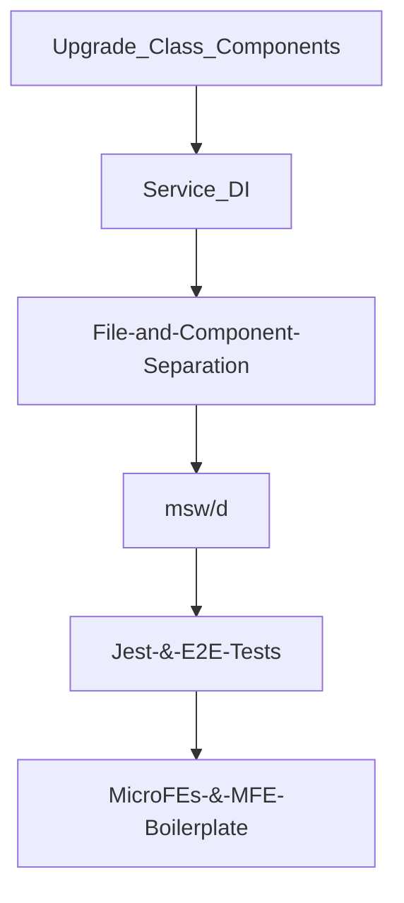
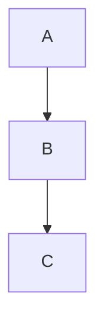

# Palo Alto Networks (PAN) Code Samples

## Code Samples

- [ ] axios Base Query, 
- [ ] fetcherService, 
- [ ] ...

- [ ] Sanitzed 🔴 BEFORE:       ✅ AFTER: 

## Impact: Tech Debt

* ctx-options
* rtk-query / separating App State from Server State
* class -> functional components
* state pyramid (include pic like 🛍 MC)
* etc...

# Impact: Testing

- [ ] include testing pyramid pic

## Impact: Agile Rituals

- [ ] Retros at end of sprint
- [ ] splitting FE from BE
- [ ] 

## Impact: Project Management

- [ ] guided PM on how to switch from Visual to Text editing mode
- [ ] guided PM on how to use markdown auto-outlining syntax
- [ ] guided PM on what is an epic, how to write Acceptance Criteria, etc.
- [ ] guided PM on benefits of markdown, mocking API servers, creating sub-tasks (of stories), linking issues, sharing Postman collections, and more

## Testimonials

- [ ] pics
- [ ] audio
- [ ] transcripts/quotes/blurbs

## UI ScreenShots of Features

## Looms of UI Features

## Screenshots / Looms of Testing

- [ ] testing pyramid

## SCREENSHOTS

## LOOMS

## BLURBS

## ctx-options

## other code samples and demo projecs

| First Header                | Second Header                |
| --------------------------- | ---------------------------- |
| Content from cell 1         | Content from cell 2          |
| Content in the first column | Content in the second column |

My **Codebase** Refactoring efforts:

My **Toolkit/Tooling, and Builder** Refactoring efforts:

