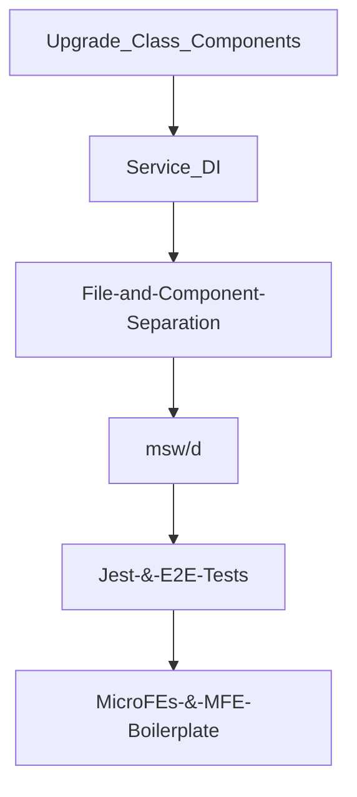
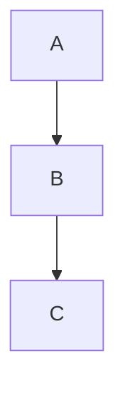

# Palo Alto Networks (PAN) Code Samples

My **Codebase** Refactoring efforts:

```mermaid
graph TD;
    Upgrade_Class_Components-->Service_DI-->File-and-Component-Separation-->msw/d-->Jest-&-E2E-Tests-->MicroFEs-&-MFE-Boilerplate;
```

My **Toolkit/Tooling, and Builder** Refactoring efforts:

```mermaid
graph TD;
    A-->B-->C;
```

