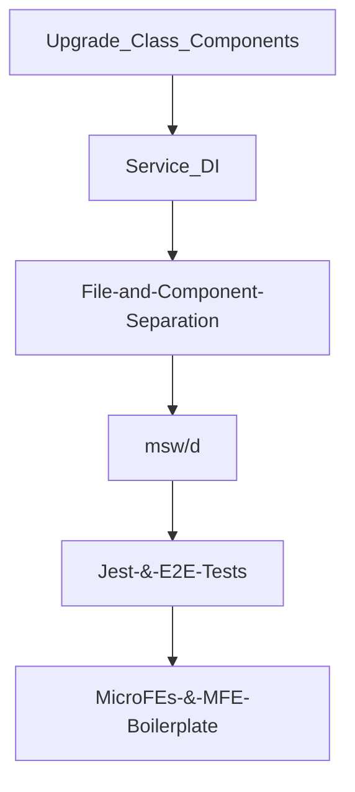
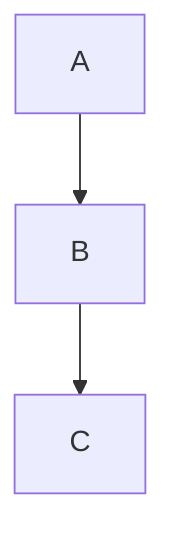

# Palo Alto Networks (PAN) Code Samples

## 🔥 ✅ Tasks:  

- [ ] spell check this!

## Code Samples

RTK-Q = *Redux ToolKit - Query*

### RTK-Q API, Endpoints, and Auto-Generated Hooks

*  [Example #1](code-samples/rtkq/api-endpoints-and-hooks.md)

### RTK-Q Builders 

* [Example #1](code-samples/rtkq/builders/example-1.md) (Get Pending Assets - Builder)
* [Example #2](code-samples/rtkq/builders/example-2.md) (Start Transfer - Builder)

### RTK-Q Cache Updates

* [Pessimistic Example](code-samples/rtkq/cache-updates/pessimistic.md) (code fragment)
* [Optimistic Example](code-samples/rtkq/cache-updates/optimistic.md) (code fragment)

* [General (from Component) Example](code-samples/rtkq/cache-updates/general.md)  (code fragment)

### Component Examples:

* [Incoming Popover](code-samples/components/incoming-popover.md) (simple)
* [Expiration Extension CTA](code-samples/components/IEECTA.md) (with react-query and Jest unit tests)
* [Transfer Asset Drawer](code-samples/components/transfer-asset-drawer.md) (more complex, with StoryBook & Cypress testing)

### Other Javascript Examples

* ["Fetcher" Service based on `fetch`](code-samples/javascript/fetch.md) 
* ["Fetcher" Service based `axios`](code-samples/javascript/axios.md) (for RTK-Q)

### POC / Spike Story Examples

- [ ] [ctx-options ("Context Options") ](https://github.com/charlieargue/ctx-options)
  - A GitHub repo I made showing patterns for avoiding React Context "over-rendering", as well as data fetching and caching
  - `RTK-Q` was chosen team-wide based on this proof-of-concept

### Mocked API Server Examples

- [ ] msw & msw/data 

### CLI Tooling Examples

- [ ] Automating repetive daily developer chores ([token.js in CLI tooling](code-samples/CLI-tooling/token.md))
- [ ] Initializing and bootstrapping `msw` ([msw.js in CLI tooling](code-samples/CLI-tooling/msw.md))

### Cypress Integration Tests

- [ ] cypress tests! (with looms)

  

## UI ScreenShots of Features

* `inline or separate file(s)?` ... maybe one separate long-scrollable file is best!
* 🔥 `TODO:` Temperature Guages (License expirations)
* IEECTA
* Transfer Drawer
* 3 Popoevers
* Pending Assets
* WildFire Popover?
* AI:  everything basically

## Looms of UI Features

## tldr; main impact:

- [ ] **msw/d** unblocked dysfunctional and regular being-blocked by BE
- [ ] delivered bug-free much-loved **features**, making the designer happy with pixel-perfect build-outs of his Figma prototypes:
  - [ ] license expiration temperature guages
  - [ ] asset transfer flows 
  - [ ] entire AI and IEECTA

- [ ] guided my supervising **staff engineer** on the **latest** general software as well as React best practices, patterns, and trends — he  adopted the following, amongst others:
  - [ ] Typora for markdown
  - [ ] having a centralized markdown-based knowledge base
  - [ ] switching to MBP (and guidance on that)
  - [ ] following React community leaders such as Kent Dobbs, Ben Awad and well-known guides such as Tao of React
  - [ ] purchasing the Epic React and Javacsript Testing workshops by Kent Dobbs, upon my personal recommendation
  - [ ] using Tabox for Chrome tab group management
  - [ ] using Github Desktop
  - [ ] using VSCode extensions such as: auto-imports, 
  - [ ] using VSCode keyboard short-cuts such as: auto-order/dedupe imports, 
  - [ ] NOT having prettier auto-format run upon each file save, but instead centralizing prettier formatting via `husky` hooks
  - [ ] Rule of 3s, ctx-options
  - [ ] separating App from Server state
- [ ] Created momentum, enthusiasm, and consus on **future** architectural decisions and upgrades, such as:
  - [ ] upgrading to Next.js (or even Remix)
  - [ ] migrating to a monorepo, such as NX or turborepo
  - [ ] running Cypress E2E tests via GitHub actions (in parallel, across multiple machines)

- [ ] Serios productivity and DX improvements thru automation:
  - [ ] token auth (dozens of MFEs and environments!)
  - [ ] msw (everything faster! not dep. on unstable BE any more)
  - [ ] no more prettier, zsh aliases, ...

## Impact: Team Velocity & Productivity & DX

- [ ] ⭐️**onblocking** blocked by BE: msw + msw/d
- [ ] repetitive chore automation 💚 (pupetteer, saving hours of dev time!)
  - [ ] Before & After Processes: **token automation**
- [ ] linking, starting, and msw command shortcuts (via `zsh` config)
- [ ] MBP cheatsheet (**and LINK to it)**
- [ ] bringing in Postman shared collections
- [ ] any other cheatsheets?

## Impact: Tech Debt

* ctx-options
* rtk-query / separating App State from Server State
* class -> functional components
* state pyramid (include pic like 🛍 MC)
* etc...

# Impact: Testing

- [ ] include testing pyramid pic
- [ ] re-use of msw & msw/d
- [ ] cypress & E2E, include 🔴 BEFORE:       ✅ AFTER: see `CSP-9659.xlsx` (blurred)

## Impact: Agile Rituals

Guided project management on:

- [ ] having Retros at end of sprint instead of during sprint
- [ ] splitting FE from BE in stand-ups
- [ ] de-coupling FE from BE in stories (separate integration stories)
- [ ] keeping stand-ups short, using call-outs in JIRA and slack, and leaning out amount of meetings

## Impact: Project Management

Guided project management on:

- [ ] how to switch from Visual to Text editing mode
- [ ] how to use markdown auto-outlining syntax
- [ ] what is an epic, how to write Acceptance Criteria, etc.
- [ ] benefits of markdown, mocking API servers, creating sub-tasks (of stories), linking issues, sharing Postman collections, and more

# Testimonials

- [ ] see my google ops doc
- [ ] pics
- [ ] audio
- [ ] transcripts/quotes/blurbs
  - [ ] PR's 100%, no bugs, refactored entire MFE w/i 1 month of being there, no bugs/revisions from QA/UAT!
- [ ] Show Alex's: `all good questions` from [JIRA pic](ALEX-2-Screen Shot 2022-02-14 at 2.15.29 PM.png)
- [ ] 
- [ ] 

## Screenshots / Looms of Testing

- [ ] testing pyramid
- [ ] looms of e2e tests of AI 

## Screenshots of JIRA / PM / Design Diagrams

- [ ] 

## ctx-options

## other code samples and demo projecs

| First Header                | Second Header                |
| --------------------------- | ---------------------------- |
| Content from cell 1         | Content from cell 2          |
| Content in the first column | Content in the second column |

My **Codebase** Refactoring efforts:

My **Toolkit/Tooling, and Builder** Refactoring efforts:

