# ✅ Tasks:  

- [ ] re-run spell checker (on ALL pages)
- [ ] print, proof-read


# PAN Code Samples

Code samples, demos and videos, and a detailed "post-mortem" and case study of my time spent at Palo Alto Networks.


# 🕙 How I Spent My Time

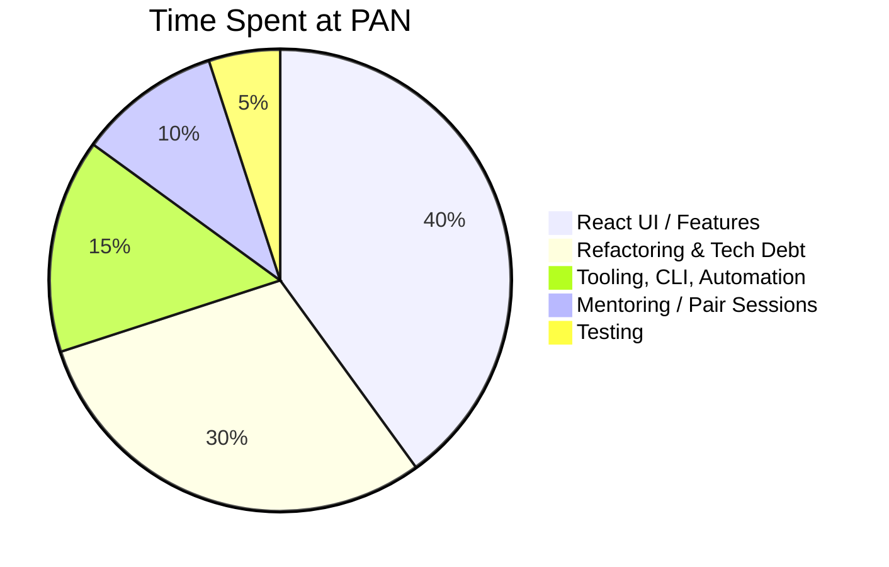

# 💻 Code Samples

<u>Terminology</u>:

`RTK` = *Redux ToolKit* (Redux basically)

`RTK-Q` = *Redux ToolKit - Query* (data fetching, cache management)

`MFE` = *Micro-Frontend*

`msw` = *Mock Service Worker*


### RTK-Q API, Endpoints, and Auto-Generated Hooks

*  [Example #1](code-samples/rtkq/api-endpoints-and-hooks.md)


### RTK-Q Builders 

* [Example #1](code-samples/rtkq/builders/example-1.md) (Get Pending Assets - Builder)
* [Example #2](code-samples/rtkq/builders/example-2.md) (Start Transfer - Builder)


### RTK-Q Cache Updates

* [Pessimistic Example](code-samples/rtkq/cache-updates/pessimistic.md) (code fragment)
* [Optimistic Example](code-samples/rtkq/cache-updates/optimistic.md) (code fragment)

* [General (from Component) Example](code-samples/rtkq/cache-updates/general.md)  (code fragment)


### Component Examples:

* [License "Temperature Gauges"](code-samples/components/temperature-gauges.md) (simple)
* [Incoming Popover](code-samples/components/incoming-popover.md) (simple)
* [Expiration Extension CTA](code-samples/components/IEECTA.md) (with **react-query** and **Jest** unit tests)
* [Transfer Asset Drawer](code-samples/components/transfer-asset-drawer.md) (more complex, with **StoryBook** & **Cypress** testing)


### Other Javascript Examples

* ["Fetcher" Service based on `fetch`](code-samples/javascript/fetch.md) 
* ["Fetcher" Service based `axios`](code-samples/javascript/axios.md) (for `RTK-Q`)


### POC / Spike Story Examples

- [ctx-options ("Context Options") ](https://github.com/charlieargue/ctx-options)
  - GitHub repo I made showing patterns for avoiding **React Context** "over-rendering" and state management
  - 🚀**IMPACT:** 
    - Clarified a critical misunderstanding of **React Context**, causing dev leadership to bypass it unnecessarily and reach for other solutions (Redux) where it would suffice
    - Introduced a technique for optimizing performance, fixing memory leaks, and eliminating unnecessary over-renders (via [Why Did You Render](https://github.com/welldone-software/why-did-you-render) library and a mix of standard solutions like `useSafeDispatch` or removing unnecessary dispatch calls)
    - `RTK` was chosen team-wide based on this proof-of-concept, and React Context was restored as a viable and primary solution for state management (both local and global)


### Mocked API Server Examples

- [`msw` and `@mswjs/data`](code-samples/msw/msw.md) 


### CLI & Tooling Examples

- [token.js](code-samples/CLI-tooling/token.md) - automates repetitive daily developer chores
- [msw.js](code-samples/CLI-tooling/msw.md) - initializes and bootstraps `msw`  for any `MFE`


### Cypress Integration Tests

- [E2E tests and tooling](code-samples/cypress/e2e.md)


# 🎦 Demos and Videos Samples

- [MSW Video](https://github.com/charlieargue/pan-code-samples/issues/1) (<2 min)
  - Follow-up video to team documentation I wrote, on how `msw` mocking works on React MFEs 

  - *I later automated all these implementation details into the MFE CLI*

- [29 Cypress E2E](https://github.com/charlieargue/pan-code-samples/issues/2) tests running against `msw` (3.5 min)

- [Demo of Asset Transfer Flows](https://github.com/charlieargue/pan-code-samples/issues/3) (before loading animations/skeletons were added)


# 👾 Sample Cheatsheet

- Team 💙-ed this [MBP "Setup Cheatsheet"](other/mbp-setup-cheatsheet.md) I made for improved DX and productivity


# ⭐️ UI Features / Highlights

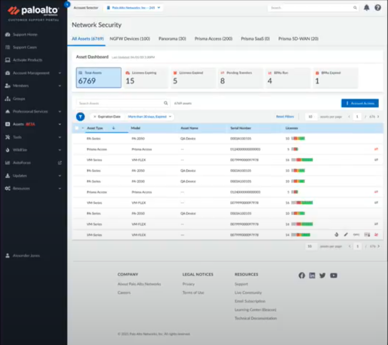

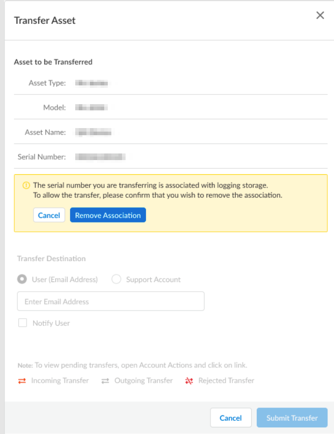

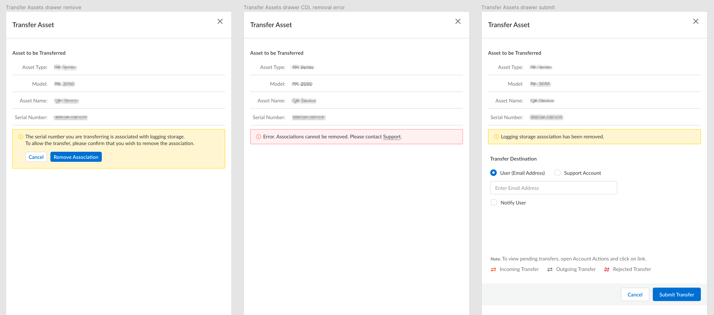

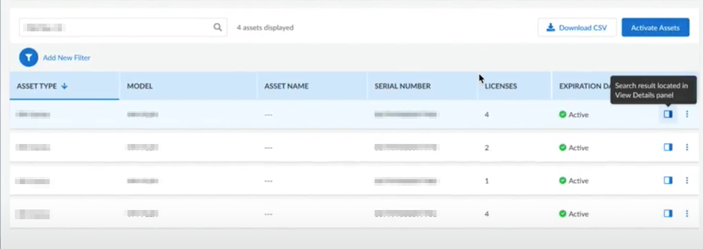


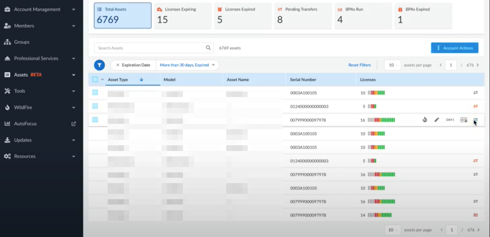


**Popover Samples:** Incoming, Outgoing, and Rejected

| 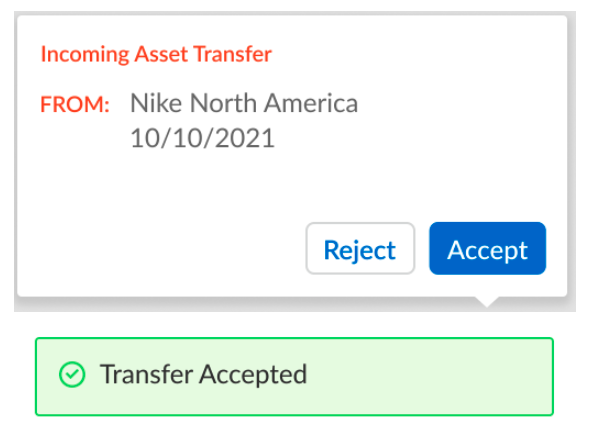 | 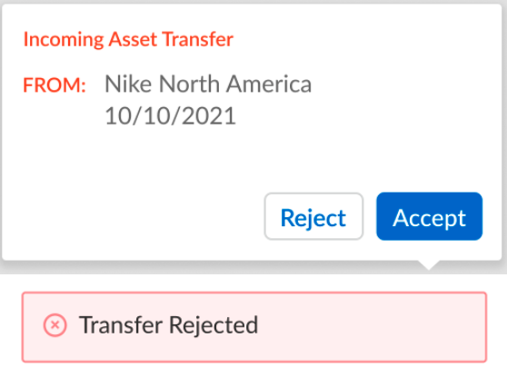 |
| ------------------------------------------------------------ | ------------------------------------------------------------ |
| 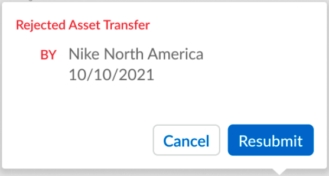 | 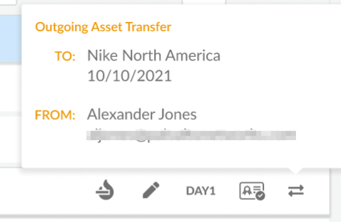 |


# 📚 Libraries I Introduced:

| Development dependencies: | Production dependencies: |
| ---- | ------------------------------------------------------------ |
| *(some removed for security)*<br />- faker<br/>- msw and @mswjs/data<br/>- RTL:<br/>  • @testing-library/react<br/>  • @testing-library/user-event<br/>  • @testing-library/cypress<br/>- cypress: <br/>  • @cypress/react<br/>  • @cypress/webpack-dev-server<br/>  • cypress-plugin-tab<br/>  - @cypress/code-coverage<br/>    • babel-plugin-istanbul<br/>    • istanbul<br/>    • istanbul-lib-coverage<br/>    • nyc<br/>- @welldone-software/why-did-you-render<br/>- husky<br />- puppeteer | - @reduxjs/toolkit (RTK-Q) |


# 📝 Sample Design Documents

Fragment from a `Hi-Level Design Doc` of all Asset Transfer workflows, helping to illustrate clearly:

* `Source` VS `Destination` users
* which MFE the action or event occurs in, i.e. ⏸ **`CPT`** VS 🛡 **`NS`** 
* and current limitations (`FUTURE ENHANCEMENTS`)

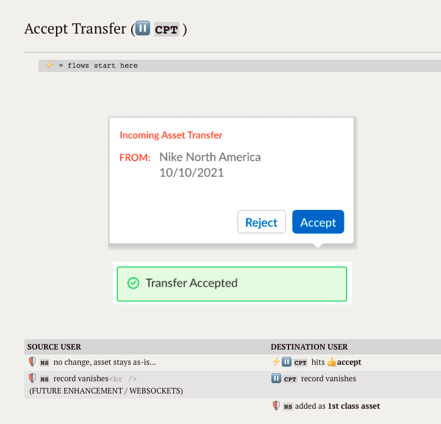


# 🚀 Positive Impact 


### `Impact on:` Testing & Mocking

- Introduced a modern **testing infrastructure** **and tooling** (`msw`, Jest, Cypress), centralized so developers could use them from any MFE (including Jest and Cypress code coverage)

- Setup next-generation **API mocking** (`msw`), that allowed effortless request interception at the network level, and seamless re-use the same mock definitions for testing, development, and debugging

- Demonstrated successful use of **Cypress E2E tests** to confidently and quickly refactor entire MFEs, to hunt/fix/prevent bugs, and as a UI unit and component testing tool (against StoryBook stories)

- Introduced Postman as a critical tool for sharing collections between BE and FE during requirements-gathering phase

- While refactoring multiple MFEs and building new features, wrote **clean, bug-free, and highly-testable code** so that services, components, utility functions, and custom hooks could all be exercised rigorously

- Guided team on what to test and how to test (see [Testing Pyramid](https://github.com/charlieargue/multi-cart#-testing), eg. how Jest component tests should check for an even handler being called where-as E2E tests should test that a toast message appeared, etc.)

- **🚀 IMPACT:** 
  
  - Solved FE team's primary pain point of blockage by BE dysfunction and unstable BE environments
  - Super-charged development velocity and allowed for rapid prototyping
  - Developers stopped putting messy mocking code all over the codebases
  - Staff engineer started using Cypress/Jest/Postman/`msw` and our joint efforts led to complete adoption by the team
  - No testing was being done on my team when I arrived, and now the staff engineer and team are writing tests nearly daily and even doing occasional TDD
  - `msw/data` in particular allowed for mocked data persistence and allowed for effectively mocking entire complex workflows and building out entire features without waiting for the BE
  - Greatly improved team's capability to deliver bug-free features
  
  

### `Impact on:` UI/UX Design

- Made the designer very happy with pixel-perfect build-outs of his Figma prototypes (thx [PerfectPixel](https://chrome.google.com/webstore/detail/perfectpixel-by-welldonec/dkaagdgjmgdmbnecmcefdhjekcoceebi?hl=en)!)
- Provided frequent useful feedback on better UI design (eg. better design of toasts and alerts for popovers in a DataTable context)
- Solved a major Data View pain-point by combining loading states for Asset Dashboard Tiles, Product Families, Search, Filters, and Data Table UI/UX, removing the need for a lot of code and buggy edge-cases (users were counter-intuitively running multiple searches at once without realizing it, resulting in race conditions, causing confusion both for users and developers)


### `Impact on:` Supervising Staff Engineer 

- [ ] Provided regular guidance to my supervising **staff engineer** on the **latest** React (and general software) best practices, patterns, and trends — he  adopted almost all of my suggestions, including but not limited to:
  - [ ] Advanced use of markdown and **Typora** (a markdown editor)
  
  - [ ] having a centralized, markdown-based **"Personal Knowledge Base"** in GitHub
  
  - [ ] switching to **MBP** (and guidance on setup and optimization)
  
  - [ ] following **React community leaders** such as Kent Dodds, Ben Awad, as patterns such as Tao of React, "Rule of Three" or "AHA Programming"
  
  - [ ] purchasing the **Epic React** and **JavaScript Testing workshops** by Kent Dodds, upon my personal recommendation
  
  - [ ] using **Tabox** for Chrome tab group management
  
  - [ ] using **Github Desktop**
  
  - [ ] **VSCode extensions**: auto-imports, spell checker, snippets, Quokka, themes, #region folding, bookmarks, Markdown to JIRA, CODDX Kanban Board, Turbo Console Log, Auto Barrel, and others
  
  - [ ] using **VSCode keyboard short-cuts** such as: auto-order/dedupe imports, auto-formatting, navigate back/forward, etc.
  
  - [ ] fixed annoying prettier auto-format that was running each time a developer saved a file, to instead run before commits via `husky`
  
  - [ ] Tao of React, Rule of 3s, AHA Programming
  
  - [ ] separating state into two categories: App state from Server state (and not keeping everything in Redux)
  
  - [ ] successfully implementing various latest patterns and libraries for state-management, data fetching, and cache management options, including pure React Context, react-tracked, react-query, and RTK-Q (Redux was already being used)                                          
  
  - [ ] clearing up misunderstandings that caused the team to shy away from pure React Context
  
  - [ ] provided clear POC repo [ctx-options](https://github.com/charlieargue/ctx-options) to demonstrate common state management solutions and patterns for dealing with React Context over-renders
  
  - [ ] successfully pushing to setup a shared PostMan collection for the team
  
  - [ ] centralizing library exports and cheatsheets in a separate dev-tools repo
  
  - [ ] establishing caching patterns and strategies
  
  - [ ] next generation API mocking for testing and development
  
  - [ ] component-based rapid prototyping with StoryBook (and then using those stories for component UI unit tests via Cypress)
  
    
  

### `Impact on:` Other Junior & Senior Team Members

- [ ] taking less experienced dev under my wing and helping thru frequent pair programming sessions
- [ ] guidance on entire dev workflows, specifically how to use:
  - [ ] StoryBook for **rapid UI prototyping**
  - [ ] `msw` and `@mswjs/data` for **rapid development** against a mocked API (wiring up data and behavior)
  - [ ] Postman, Jest, and Cypress for building an efficient and robust **testing pyramid**
  - [ ] other tips and best practices (see cheatsheet)


### `Impact on:` Team Productivity & DX

- [ ] repetitive chore automation 💚 (puppeteer, saving hours of dev time, (dozens of MFEs and environments!)
  - [ ] Before & After Processes: **token automation**
- [ ] linking, starting, and msw command shortcuts (via `zsh` config)
- [ ] no more prettier sheesh! introduced husky
- [ ] VSCode extensions, chrome extensions, see MBP cheatsheet
- [ ] husky & the DISABLE_PRETTIER flag (before that, each time a developer would save their file, the prettier auto-format would run, losing their place on the screen, un-folding all folded code, and causing all sorts of other headaches)
- [ ] using [loom](https://www.loom.com/) videos to quickly and easily communicate status updates on features, and much more


### `Impact on:` Agile and Project Management

<u>Introduced</u>:

- proper Acceptance Criteria
- epic kick-offs (w/ design-docs for medium-to-hard stories)
- post-mortems
- 1-on-1s 

<u>Guided project management on:</u>

- having Retros at end of sprint instead of during sprint
- NOT re-defining Stand-ups (they wanted to change them to be normalized around features instead of team members)
- splitting FE from BE in stand-ups
- de-coupling FE from BE in stories (separate integration stories)
- keeping stand-ups short, using call-outs in JIRA and slack, and leaning out amount of meetings
- how to switch from Visual to Text editing mode
- how to use markdown auto-outlining syntax
- what is an epic, how to write Acceptance Criteria, etc.
- how to attach images inline (and not at bottom) of description
- how to insert markdown tables and formatted code blocks
- benefits of markdown, mocking API servers, creating sub-tasks (of stories), linking issues, sharing Postman collections, and more
- lessening the amount of meetings (amount was affecting the team's development productivity)
- guidance on ceremonies: when and how to have/do Sprint Planning


### `Impact on:` Future Directions

Created momentum, enthusiasm, and consensus on future architectural decisions and upgrades, such as:

- [ ] upgrading to **Next.js** (team now even considering **Remix**!)
- [ ] migrating to a **monorepo**, such as **NX**  (team now even considering **TurboRepo**!)
- [ ] running Cypress E2E tests in **CICD** via **GitHub actions** and **Cypress Dashboard** (provided .yml scripts for running E2E tests in parallel, across multiple machines)
- [ ] guidance on how to create **"Testing Sandboxes"** (by dynamically generating test roles, accounts, users, assets, etc.)
- [ ] guidance on how to setup screenshot **UI Regression Testing** (via Happo, StoryBook, and Cypress)
- [ ] guidance on using [Plop](https://plopjs.com/) to **automatically generate** and scaffold new files with consistency


# 📊 Other Resources and Samples


### Tech Debt & Refactoring Journey

A simplified flow-chart highlighting key points in the path I took to successfully remove a huge amount of technical debt and refactor multiple MFEs, while simultaneously delivering much-loved new UI features:


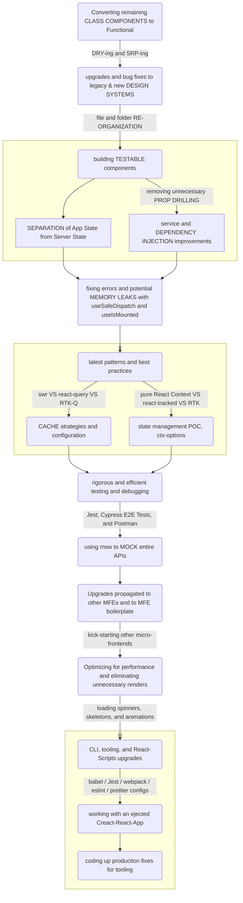


### Simplified "Where to Put State" Flow Chart

Inspired by [Kent Dodds' decision tree chart](https://kentcdodds.com/blog/state-colocation-will-make-your-react-app-faster#so-how-do-you-decide-where-to-put-state):

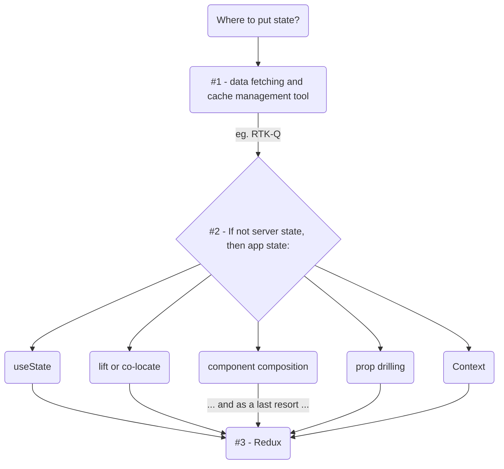


### My "JIRA Process" 

From a FE Perspective:

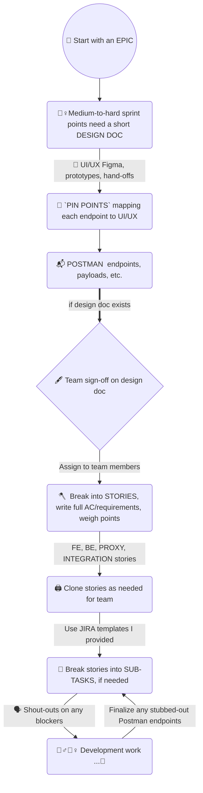


### My "Testing Pyramid"

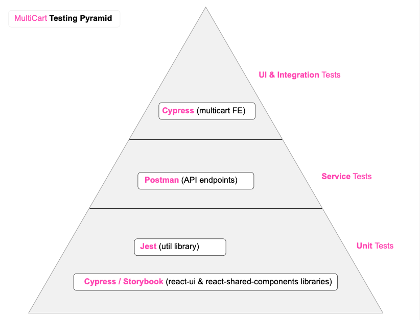


### Example of Clear Communication (in JIRA)

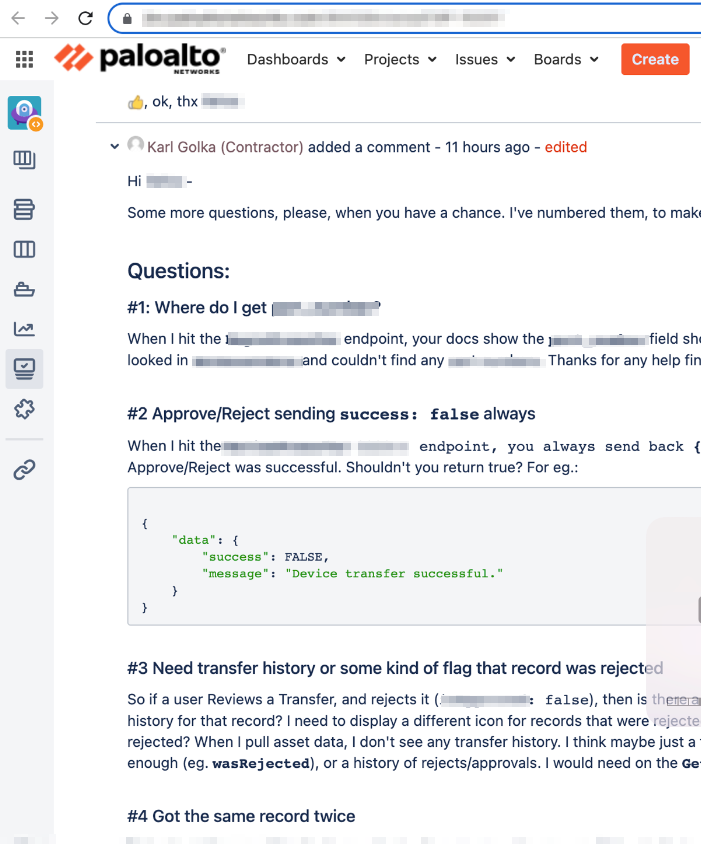


### Effective Use of Redux Dev-Tools and Profiler:

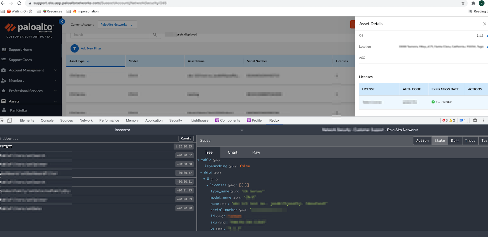


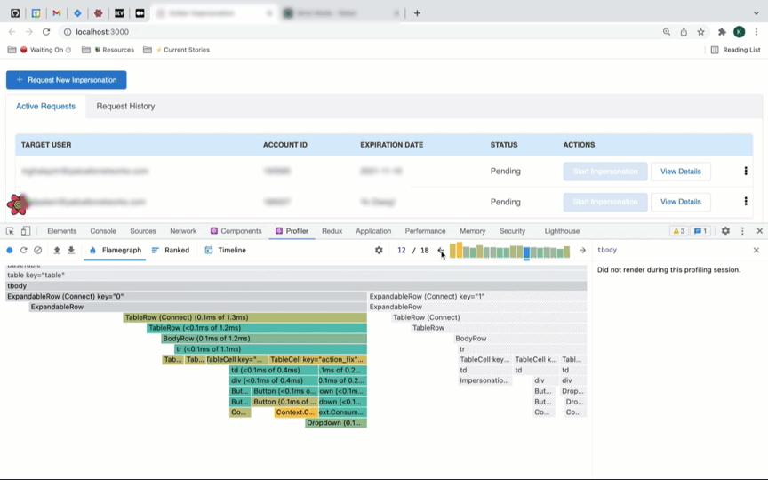


# 🗣 Testimonials & Feedback

`Mazen Ghalayini` — Staff React Engineer, Direct Supervisor ([LinkedIn](https://www.linkedin.com/in/mazen-g-a76139179/), mghalayini@paloaltonetworks.com)

`Hanford Choy` — Non-Technical Project Manager (hchoy@paloaltonetworks.com)

`Alexander Jones` — Team Head Designer ([LinkedIn](https://www.linkedin.com/in/alexander-jones7/), aljones@paloaltonetworks.com)

`Palak Mehrotra` — Senior Software Engineer ([LinkedIn](https://www.linkedin.com/in/palakmehrotra/))

`Veerendra Vundavalli`  — .NET & React (+Native) Developer ([LinkedIn](https://www.linkedin.com/in/veerendravundavalli/))


### Feedback after First Demo 

 `Jan 21, 2022` (*from #slack*)

| 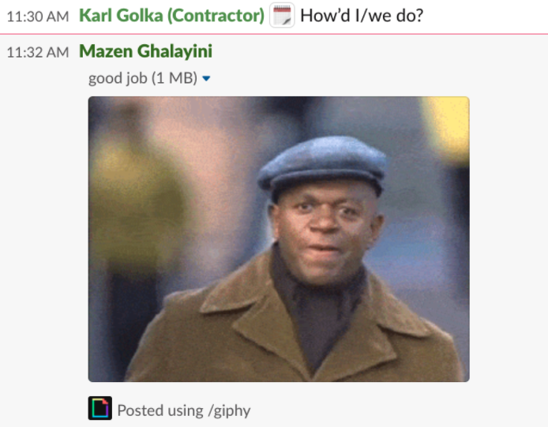 |  |
| ------------------------------------------------------------ | --------------------------------------- |


### Feedback from Project Management

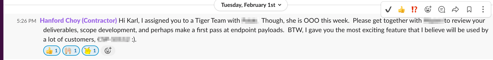

> "BTW, I gave you the most exciting feature that I believe will be used by a lot of customers :)."  
>
> — 🗣 *Hanford Choy*,  `Feb 1, 2022`


> "Karl, [epic] looks really good. Congrats! I could not find any issues, and closed this ticket."
> 
> — 🗣 *Hanford Choy*,  `Dec 7, 2021`


### Feedback from Supervising Staff Engineers

<audio src="_markdown_assets/audio/Code-Credentials-CLIP.wav"></audio>

> "As far as coding, your credentials are extremely high, I mean, there's not much I can teach you... if anything, I'm probably gonna have to learn from you..." [during 1-on-1 performance review] 
>
> — 🗣 *Mazen Ghalayini* `Feb 15, 2022`
>
> "I love what you did with puppeteer." [<u>re:</u> automating MFE token authentication] 
> — 🗣 *Mazen Ghalayini* `Dec 9, 2021`
>
> 
>
> "It was a great effort on the MFE refactoring." 
>
> — 🗣 *Mazen Ghalayini* `Jan 18, 2021`
>
>
> "Alright, let's give it a shot!" [<u>re</u>: adopting my idea for a shared Postman collection between FE and BE teams] 
>
> — 🗣 *Mazen Ghalayini*  `Feb 22, 2022`
>
> 
>
> "... [unlike other engineer, whose PR's are] total re-wsrites sometimes... yours so far have been very good, I've only needed to do CSS-stuff [minor things]... keep [doing] what you're doing, you're doing good... you've definitely like learned a lot about how we do things, and you probably now have a really good grasp of how things work... you've been doing great... so just continue to do that, that's great [<u>re:</u> my successful team adoption efforts]... " [during 1-on-1 performance review] 
>
> — 🗣 *Mazen Ghalayini*  `Feb 15, 2022`
>
> 
>
> "...you know, also, ... we're kind of under siege from [a lot of directions]... so yeah, I think your suggestion is a good one that we need to try..."  [<u>re</u>: to seriously consider GraphQL as an option] 
>
> — 🗣 *Vish Ramamurthy*  `Feb 23, 2022`
>
>
> "You're doing better than all the other people that I onboarded. I'm the first UI developer [on this Rewrite Team], and then it was two others, and a third one, ... two got kicked out, one is still with us, and you are the last one now! ... In my opinion, you definitely are showing the right attitude, and I'm getting the right signals from others... and if you need me to vouch for you, I'm going to give them the thumbs-up... and so far I think you're doing good because I get a pretty good impression from someone higher than me.... he's said good things about you, so keep it up, and you'll get recognized... and hired... I think you'll definitely get there, and it'll be good for Palo Alto, I mean you're a very good candidate for them!" [<u>re:</u> converting from contractor to full-time employment]." 
> — 🗣 *Mazen Ghalayini*  `Dec 8, 2021` 


### Feedback from Designer

> "You're selling it, that's exactly what I'm looking for!" [re: toast notifications, popover messaging, and row highlighting proposals] 
>
> — 🗣 *Alexander Jones*  `Feb 23, 2022`


### Feedback from BE/FE Team

> "I agree with Karl, actually." [<u>re</u>: my clarifying Big Query vs MySQL confusion on Asset Transfer epic] — 🗣 *Palak Mehrotra*  `Feb 23, 2022`
>
> 
>
> "Thanks to Mazen and Karl for all their help on UI and Artifactory setup" 
>
> — 🗣 *Veerendra Vundavalli*  `Feb, 2022`


## ✅ Tasks:  	

- [ ] 🔥🔥🔥🔥🔥🔥 insert **27'39"** `1-on-1` Feb 15🔥 audio clip!

- [ ] Mazen - AI REFAC is excellent (Jan 4, 2022), **2:00:41**🔥 audio clip!

  - [ ] "I think this is excellent work, I think we're moving at a really good pace." [<u>re:</u> MFE refactoring and eliminating tech debt]

- [x] audio (iphone), 

  - [x] 🔥 esp.  entire Mazen VIP recording plz asap! (from **Thur, Feb 10, 2022**)

- [ ] 🔥 See #iphone recordings with Mazen (Accomplishment one, right before SPUI Part 1/2/3)

  


# 🔗 Other Code Samples / Repos

Not related to Palo Alto Networks:

- https://github.com/charlieargue/multi-cart#-code-samples (React • GQL • Serverless)
- https://github.com/charlieargue/multi-cart-pg (React • GQL • PERN stack + Typescript)
- https://github.com/charlieargue/multi-cart-MRP-containers (Minimum Reproducible Project) 
  - made while trouble-shooting my GitHub Actions `.yml` script
  - helped me successfully run Cypress E2E specs across multiple machines in parallel 
  - helped in fixing CICD `yarn` and `npm` caching issues
- https://github.com/charlieargue/clickup-july-table (Successfully-passed Angular Interview take-home test for [ClickUp.com](https://clickup.com/))


# ⏳ Reasons for Transition


### A) Project Management

Project Management lacked skills,  did Agile "their way", only adding to already-existing serious dysfunction, and proved impervious to course correction and advice:


#### They decided to <u>re-define an Epic</u> down to the Sub-Task level in JIRA's hierarchy

- thereby breaking how branches are made and used
- and creating exponentially more epics, stories, and sub-tasks than necessary

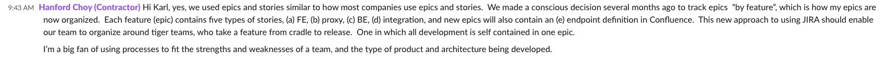


#### They wanted to <u>re-define Stand-ups</u> so as to normalize them around features instead of team members

- so instead of 
  - **Person 1**: `yesterday, today, blockers: All Features` 
  - **Person 2**: `yesterday, today, blockers: All Features`
  - etc...
- they wanted:
  - **Feature A**: *Person 1:* `yesterday, today, blockers`
  - **Feature A**: *Person 2:* `yesterday, today, blockers`
  - **Feature B**: *Person 1:* `yesterday, today, blockers`
  - **Feature B**: *Person 2:* `yesterday, today, blockers`
  - **Feature C**: *Person 1:* `yesterday, today, blockers`
  - **Feature C**: *Person 2:* `yesterday, today, blockers`
- this was decided upon in a context of already-dysfunctional Agile processes, where daily Stand-up ceremonies regularly took more than one hour and did little to relieve team blockage


### B) Supervising Staff Engineer

As an example, I received push-back (but finally prevailed) when suggesting that we DO NOT keep adding to this file infinitely, and instead refactor it into one line:

```js 
// file: /src/utils/units.js

// EXAMPLE USAGE: `padding: ${units[30]};`

// -----------------------
// 🔴 BEFORE:       
// -----------------------
export default {
    0: '0',
    1: '1px',
    2: '2px',
    3: '3px',
    4: '4px',
    6: '6px',
    7: '7px',
    8: '8px',
    9: '9px',
    10: '10px',
    11: '11px',
    12: '12px',
    14: '14px',
    15: '15px',
    16: '16px',
    17: '17px',
    18: '18px',
    20: '20px',
    22: '22px',
    24: '24px',
    25: '25px',
    28: '28px',
    29: '29px',
    30: '30px',
    32: '32px',
    33: '33px',
    35: '35px',
    36: '36px',
    40: '40px',
    44: '44px',
    48: '48px',
    56: '56px',
    64: '64px',
    72: '72px',
    76: '76px',
    80: '80px',
    96: '96px',
    112: '112px',
    128: '128px',
    144: '144px',
    160: '160px',
    168: '168px',
    176: '176px',
    184: '184px',
    192: '192px',
    208: '208px',
    222: '222px',
    224: '224px',
    240: '240px',
    250: '250px',
    255: '255px',
    256: '256px',
    270: '270px',
    288: '288px',
    320: '320px',
    350: '350px',
    450: '450px',
    384: '384px',
    541: '541px',
  
  // So, for example, if you needed a width of 542px or a line-height of 31px in a MFE, 
    // you had to go here and add that line explicitly, bump up the versions, 
    // and re-link the repo so you could use it in a MFE, etc.
};

// -----------------------
// ✅ AFTER: 
// -----------------------
const remCalc = (pixelValue) => {
   return pixelValue === 0 ? '0' : `'${value}px'`;

   // THEN LATER:       pixelValue / x = rems 
   // AND MUCH LATER:   switch to just using rems, once legacy ASP.NET CSS issue fixed
};
```


# ✉️ Contact Me

My personal website is https://karlgolka.com/ and you can email me at contact@karlgolka.com 

