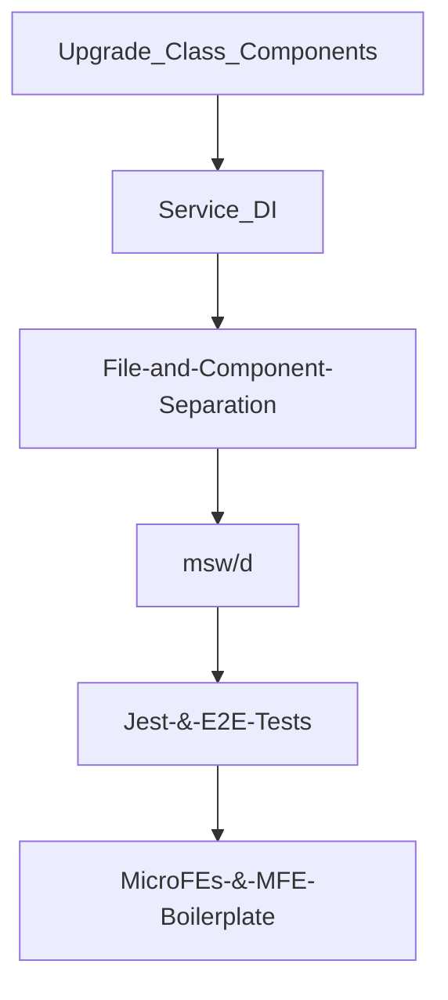
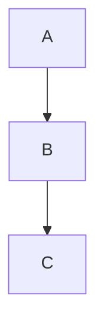

# Palo Alto Networks (PAN) Code Samples


# 📚 Resources 

- [ ] https://blur.page/
- [ ] https://divbyzero.com/tools/blur-extension/#howto


## tldr; main impact:

- [ ] **msw/d** unblocked dysfunctional and regular being-blocked by BE
- [ ] delivered bug-free much-loved **features**, making the designer happy with pixel-perfect build-outs of his Figma prototypes:
  - [ ] license expiration temperature guages
  - [ ] asset transfer flows 
  - [ ] entire AI and IEECTA

- [ ] guided my supervising **staff engineer** on the **latest** general software as well as React best practices, patterns, and trends — he  adopted the following, amongst others:
  - [ ] Typora for markdown
  - [ ] having a centralized markdown-based knowledge base
  - [ ] switching to MBP (and guidance on that)
  - [ ] following React community leaders such as Kent Dobbs, Ben Awad and well-known guides such as Tao of React
  - [ ] purchasing the Epic React and Javacsript Testing workshops by Kent Dobbs, upon my personal recommendation
  - [ ] using Tabox for Chrome tab group management
  - [ ] using Github Desktop
  - [ ] using VSCode extensions such as: auto-imports, 
  - [ ] using VSCode keyboard short-cuts such as: auto-order/dedupe imports, 
  - [ ] NOT having prettier auto-format run upon each file save, but instead centralizing prettier formatting via `husky` hooks
  - [ ] Rule of 3s, ctx-options
  - [ ] separating App from Server state
- [ ] Created momentum, enthusiasm, and consus on **future** architectural decisions and upgrades, such as:
  - [ ] upgrading to Next.js (or even Remix)
  - [ ] migrating to a monorepo, such as NX or turborepo
  - [ ] running Cypress E2E tests via GitHub actions (in parallel, across multiple machines)

- [ ] Serios productivity and DX improvements thru automation:
  - [ ] token auth (dozens of MFEs and environments!)
  - [ ] msw (everything faster! not dep. on unstable BE any more)
  - [ ] no more prettier, zsh aliases, ...


## Code Samples


### RTK-Q Builders

#### Example #1:

```js 
// file: src/rtkq/builders/getPendingAssetsBuilder.js
const url = '/api/Lorem/Ipsum';

export const getPendingAssetsBuilder = (builder) =>
    builder.query({
        query: ({ userAccountId, supportAccountId }) => {
            return {
                url,
                method: 'GET',
                params: { userAccountId, supportAccountId },
            };
        },
        providesTags: result =>
            result
                ? [
                    ...result?.map(
                        ({ device_transfer_id }) =>
                            ({ type: 'Transfer', id: device_transfer_id })),
                    { type: 'Transfer', id: 'LIST' },

                ]
                : [{ type: 'Transfer', id: 'LIST' }],
    });

export default getPendingAssetsBuilder;
```


#### Example #2:

```js 
// file: src/rtkq/builders/startTransferBuilder.js
const url = '/api/Lorem/Ipsum';

export const startTransferBuilder = (builder) =>
    builder.mutation({
        query: ({ userAccountId, supportAccountId, formValues, record }) => {
            return {
                url,
                method: 'POST',
                params: {
                    userAccountId,
                    supportAccountId,
                },
                body: buildBody(supportAccountId, formValues, record)
            };
        },
        invalidatesTags: (result, error, { record }) => {
            return [{ type: 'Asset', id: record.id }];
        },
    });

function buildBody(supportAccountId, formValues, record) {
    let transferBy;
    let destination;
    if (formValues['transfer-destination'] === 'USER') {
        transferBy = "EmailRecipient";
        destination = {
            destination_email: formValues.email,
        };

    } else if (formValues['transfer-destination'] === 'SUPPORT_ACCOUNT') {
        transferBy = "SupportAccount";
        destination = {
            support_account_id: supportAccountId,
        };

    }
    const payload = {
        device_id: record.id,
        device_name: record.name,
        has_asc_transfer_access: false,
        has_lgs_associated: record.has_lgs_associated,
        notify_user: formValues['notify-user'],
        part_number: null, // legacy, can be null
        serial_number: record.serial_number,
        transfer_by: transferBy,
        ...destination,
    };
    return payload;
}

export default startTransferBuilder;
```


### RTK-Q Cache Updates

#### Pessimistic Example:

```js 
// file: src/hooks/rtk-query/api-and-hooks.js (FRAGMENT)

extendExpirationDate: build.mutation({
    async queryFn({ requestId }, { dispatch, getState }) {
        try {
            const result = await extendExpirationDate(getState, requestId);
            Message.info('Request was successful.', MESSAGE_DISPLAY_DURATION);
            return result;
        } catch (error) {
            return handleReduxError(error, dispatch, setGlobal);
        } finally {
          dispatch(setGlobal({ isFetchingRequests: false }));
        }
    },
    async onQueryStarted({ ...patch }, { dispatch, queryFulfilled }) {
        dispatch(setGlobal({ isFetchingRequests: true }));
        const { data: updatedRequest } = await queryFulfilled;
        dispatch(
            api.util.updateQueryData('getActiveRequests', undefined, draftRequests => {
                const foundDraft = draftRequests.find(
                    request => request.requestId === patch.requestId
                );
                delete foundDraft.isExpiring;
                foundDraft.expirationDate = updatedRequest.expirationDate;
            })
        );
    },
}),
```


#### Optimistic Example:

```js 
// file: src/rtkq/builders/getPendingAssetsBuilder.js (FRAGMENT)

onQueryStarted(
  { userAccountId, supportAccountId, deviceTransferId }, 
  { dispatch, queryFulfilled }) {
  const fresh = dispatch(
      api.util.updateQueryData(
          'getPendingAssets',
          { userAccountId, supportAccountId },
          drafts => {
              const foundDraft = drafts.find(draft => 
                       draft.device_transfer_id === deviceTransferId);
              Object.assign(foundDraft, {
                  device_transfer_state: TRANSFER_STATUS.ACCEPTED,
              });
          }
      )
  );
  queryFulfilled.catch(fresh.undo);
},
```


#### General (from Component) Example:

```js 
// file: src/components/popovers/incoming/IncomingPopover.jsx (FRAGMENT)

const onAcceptClick = async () => {
  await triggerAccept({ userAccountId, supportAccountId, deviceTransferId });
  setAlertVisibility(ALERT_VISIBILITY_STATES.ACCEPTED_ALERT);
  setTimeout(() => {
      dispatch(
          api.util.updateQueryData(
              'getPendingAssets',
              { userAccountId, supportAccountId },
              (drafts) => {
                  drafts.splice(
                      drafts.findIndex(
                          (draft) => draft.device_transfer_id === deviceTransferId,
                      ),
                      1,
                  );
              },
          ),
      );
  }, PO_ALERT_TIMEOUT);
};
```


- [ ] axios Base Query, 
- [ ] fetcherService, 
- [ ] show complete component heirarchy (Transfers were most recent)
- [ ] ... IEECTA was originally in rtk-query, right??? or was there a version b4 that? react-tracked? ... something changed in how the cache was done, no? check...
- [ ] Sanitzed 🔴 BEFORE:       ✅ AFTER:
  - [ ] units.js
  - [ ] App.js 
  - [ ] AI in generale
  - [ ] Componentizing! (into `Review`, `Details`, etc...)
  - [ ] **MFE-B** might be good, b-and-a
  - [ ] useFetch and everything in redux lol -> rtk-query + cache
  - [ ] centralized error handling!
  - [ ] bindClass service stuff -> builders only super lean, show size
  - [ ] barelling and better import/export patterns


## UI ScreenShots of Features

- [ ] 


## Looms of UI Features


## Impact: Team Velocity & Productivity & DX

- [ ] ⭐️**onblocking** blocked by BE: msw + msw/d
- [ ] repetitive chore automation 💚 (pupetteer, saving hours of dev time!)
  - [ ] Before & After Processes: **token automation**
- [ ] linking, starting, and msw command shortcuts (via `zsh` config)
- [ ] MBP cheatsheet (**and LINK to it)**
- [ ] bringing in Postman shared collections
- [ ] any other cheatsheets?


## Impact: Tech Debt

* ctx-options
* rtk-query / separating App State from Server State
* class -> functional components
* state pyramid (include pic like 🛍 MC)
* etc...


# Impact: Testing

- [ ] include testing pyramid pic
- [ ] re-use of msw & msw/d
- [ ] cypress & E2E, include 🔴 BEFORE:       ✅ AFTER: see `CSP-9659.xlsx` (blurred)


## Impact: Agile Rituals

Guided project management on:

- [ ] having Retros at end of sprint instead of during sprint
- [ ] splitting FE from BE in stand-ups
- [ ] de-coupling FE from BE in stories (separate integration stories)
- [ ] keeping stand-ups short, using call-outs in JIRA and slack, and leaning out amount of meetings


## Impact: Project Management

Guided project management on:

- [ ] how to switch from Visual to Text editing mode
- [ ] how to use markdown auto-outlining syntax
- [ ] what is an epic, how to write Acceptance Criteria, etc.
- [ ] benefits of markdown, mocking API servers, creating sub-tasks (of stories), linking issues, sharing Postman collections, and more


# Testimonials

- [ ] see my google ops doc
- [ ] pics
- [ ] audio
- [ ] transcripts/quotes/blurbs
  - [ ] PR's 100%, no bugs, refactored entire MFE w/i 1 month of being there, no bugs/revisions from QA/UAT!
- [ ] Show Alex's: `all good questions` from [JIRA pic](ALEX-2-Screen Shot 2022-02-14 at 2.15.29 PM.png)
- [ ] 
- [ ] 


## Screenshots / Looms of Testing

- [ ] testing pyramid
- [ ] looms of e2e tests of AI 


## Screenshots of JIRA / PM / Design Diagrams

- [ ] 


## ctx-options

## other code samples and demo projecs


| First Header                | Second Header                |
| --------------------------- | ---------------------------- |
| Content from cell 1         | Content from cell 2          |
| Content in the first column | Content in the second column |


My **Codebase** Refactoring efforts:



My **Toolkit/Tooling, and Builder** Refactoring efforts:



