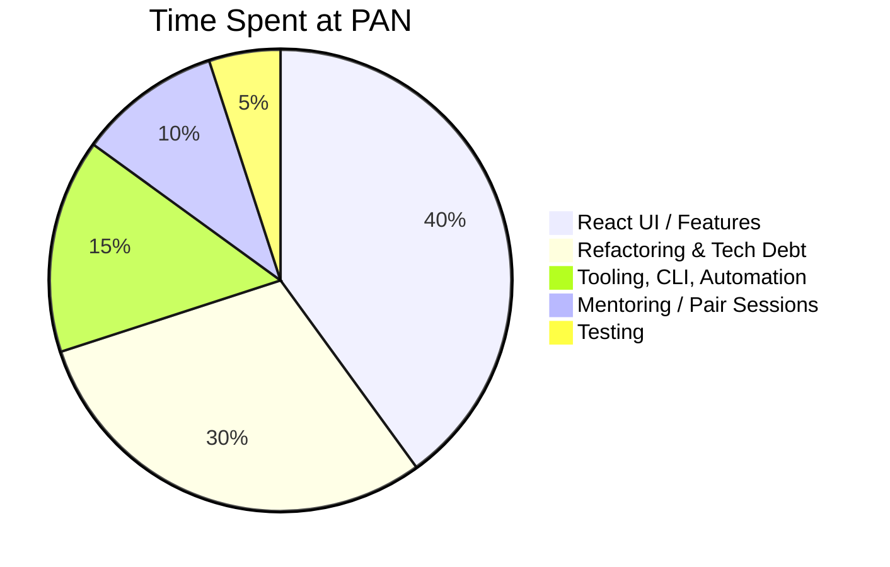

# Palo Alto Networks (PAN) Code Samples

## 🕙 How I Spent My Time

## 💻 Code Samples

`RTK-Q` = *Redux ToolKit - Query*

`MFE` = *Micro-Frontend*

`msw` = *Mock Service Worker*

### RTK-Q API, Endpoints, and Auto-Generated Hooks

*  [Example #1](code-samples/rtkq/api-endpoints-and-hooks.md)

### RTK-Q Builders 

* [Example #1](code-samples/rtkq/builders/example-1.md) (Get Pending Assets - Builder)
* [Example #2](code-samples/rtkq/builders/example-2.md) (Start Transfer - Builder)

### RTK-Q Cache Updates

* [Pessimistic Example](code-samples/rtkq/cache-updates/pessimistic.md) (code fragment)
* [Optimistic Example](code-samples/rtkq/cache-updates/optimistic.md) (code fragment)

* [General (from Component) Example](code-samples/rtkq/cache-updates/general.md)  (code fragment)

### Component Examples:

* [License "Temperature Gauges"](code-samples/components/temperature-gauges.md) (simple)
* [Incoming Popover](code-samples/components/incoming-popover.md) (simple)
* [Expiration Extension CTA](code-samples/components/IEECTA.md) (with **react-query** and **Jest** unit tests)
* [Transfer Asset Drawer](code-samples/components/transfer-asset-drawer.md) (more complex, with **StoryBook** & **Cypress** testing)

### Other Javascript Examples

* ["Fetcher" Service based on `fetch`](code-samples/javascript/fetch.md) 
* ["Fetcher" Service based `axios`](code-samples/javascript/axios.md) (for `RTK-Q`)

### POC / Spike Story Examples

- [ctx-options ("Context Options") ](https://github.com/charlieargue/ctx-options)
  - GitHub repo I made showing patterns for avoiding **React Context** "over-rendering", as well as data fetching and caching
  - `RTK-Q` was chosen team-wide based on this proof-of-concept

### Mocked API Server Examples

- [`msw` and `@mswjs/data`](code-samples/msw/msw.md) 

### CLI & Tooling Examples

- [token.js](code-samples/CLI-tooling/token.md) - automates repetitive daily developer chores
- [msw.js](code-samples/CLI-tooling/msw.md) - initializes and bootstraps `msw`  for any `MFE`

### Cypress Integration Tests

- [E2E tests and tooling](code-samples/cypress/e2e.md)

## 🎦 Demos and Videos Samples

- [MSW Video](https://github.com/charlieargue/pan-code-samples/issues/1) (<2 min)
  - Follow-up video to team documentation I wrote, on how `msw` mocking works on React MFEs 

  - *I later automated all these implementation details into the MFE CLI*

- [29 Cypress E2E](https://github.com/charlieargue/pan-code-samples/issues/2) tests running against `msw` (3.5 min)

- [Demo of Asset Transfer Flows](https://github.com/charlieargue/pan-code-samples/issues/3) (before loading animations/skeletons were added)

## 👾 Sample Cheatsheet

- Team 💙 this [MBP "Setup Cheatsheet"](other/mbp-setup-cheatsheet.md) I made for improved DX and productivity

## ⭐️ UI Features / Highlights

###### Popovers

|  |  |
| ------------------------------------------------------------ | ------------------------------------------------------------ |
|  |  |

## Main Impact Areas

### Refactoring and Tech Debt flow chart / process 

- [ ] 🔥(do a gant chart! just timeline!) use my notes/Ops to make it super realistic!

* lots of dealing with **TECH DEBT** (hit the ground sprinting cleaning up tech debt!):
* **refactoring entire MFE after 1 month being there!!!**
  * then refactoring another, and then refactoring the MFE-boilerplate so all future MFEs have the same standards and patterns
* service architecture / DI refactoring
* upgrading away from legacy class components
* DRY-ing / SRP-ing / Tao of React-ing EVERYTHING!
* the MFEs/apps/components were basically UNTESTABLE before this!
* rigorous and efficient testing
* Msw 
* useContext upgrade
* ErrorBoundary (for every MFE!), before just crashed app, now EVERY MFE is safely container and doesn't crash and shows nice error!
* fixed broken error handling for all ambr-impr!
* rtk-q
* better statemanagement (where to put state, Context clarificaiton, staff engineer was against using context because of a fundamental misunderstanding of how it works, see ctx-options)
* caching strategies

### "Where to Put State" flow chart

### Testing & Mocking

- Setup modern **testing infrastructure** **and tooling** (`msw`, Jest, Cypress), centralized so developers could use them from any MFE
- Setup next-generation **API mocking** (`msw`), that allowed effortless request interception at the network level, and seamless re-use the same mock definitions for testing, development, and debugging
- Demonstrated successful use of **Cypress E2E tests** to confidently and quickly refactor entire MFEs, to hunt/fix/prevent bugs, and as a UI unit and component testing tool (against StoryBook stories)
- Introduced Postman as a critical tool for sharing collections between BE and FE during requirements-gathering phase
- Guided team on what to test and how to test (see [Testing Pyramid](https://github.com/charlieargue/multi-cart#-testing))
- **🚀 IMPACT:** 
  - Solved FE team's primary pain point of blockage by BE dysfunction and unstable BE environments
  - Super-charged development velocity and allowed for rapid prototyping
  - Developers stopped putting mocking code all over the codebase
  - Staff engineer started using Cypress/Jest/Postman/`msw` and our joint efforts led to complete adoption by the team
  - `msw/data` in particular allowed for mocked data persistence and allowed for effectively mocking entire complex workflows and building out entire features without waiting for the BE
  - Greatly improved team's capability to deliver bug-free features

### Design Impact:

- Made the designer very happy with pixel-perfect build-outs of his Figma prototypes (thx [PerfectPixel](https://chrome.google.com/webstore/detail/perfectpixel-by-welldonec/dkaagdgjmgdmbnecmcefdhjekcoceebi?hl=en)!)
- Provided frequent useful feedback on better UI design (eg. better design of toasts and alerts for popovers in a DataTable context)

### Mentoring the Staff Engineer

- [ ] Provided regular guidance to my supervising **staff engineer** on the **latest** React (and general software) best practices, patterns, and trends — he  adopted almost all of my suggestions, including but not limited to:
  - [ ] Typora for markdown
  - [ ] having a centralized markdown-based knowledge base
  - [ ] switching to MBP (and guidance on that)
  - [ ] following React community leaders such as Kent Dobbs, Ben Awad and well-known guides such as Tao of React
  - [ ] purchasing the Epic React and JavaScript Testing workshops by Kent Dobbs, upon my personal recommendation
  - [ ] using Tabox for Chrome tab group management
  - [ ] switching to Github Desktop
  - [ ] switching to VSCode extensions such as: auto-imports, spell checker, snippets, Quokka, etc.
  - [ ] using VSCode keyboard short-cuts such as: auto-order/dedupe imports, auto-formatting, etc.
  - [ ] NOT having prettier auto-format run upon each file save, but instead centralizing prettier formatting via `husky` hooks
  - [ ] Rule of 3s, ctx-options
  - [ ] separating App from Server state

  

### Team Productivity & DX

- [ ] repetitive chore automation 💚 (puppeteer, saving hours of dev time, (dozens of MFEs and environments!)
  - [ ] Before & After Processes: **token automation**
- [ ] linking, starting, and msw command shortcuts (via `zsh` config)
- [ ] no more prettier sheesh! introduced husky
- [ ] VSCode extensions, chrome extensions, see MBP cheatsheet

### Future Directions

Created momentum, enthusiasm, and consensus on **future** architectural decisions and upgrades, such as:

- [ ] upgrading to Next.js (team now even considering Remix!)
- [ ] migrating to a monorepo, such as NX  (team now even considering TurboRepo!)
- [ ] running Cypress E2E tests in CICD via GitHub actions (provided GitHub .yml scripts for running E2E tests in parallel, across multiple machines)

### Tech Debt

* ctx-options
* rtk-query / separating App State from Server State
* class -> functional components
* state pyramid (include pic like 🛍 MC)
* etc...

### Agile and Project Management

Guided project management on:

- [ ] having Retros at end of sprint instead of during sprint
- [ ] splitting FE from BE in stand-ups
- [ ] de-coupling FE from BE in stories (separate integration stories)
- [ ] keeping stand-ups short, using call-outs in JIRA and slack, and leaning out amount of meetings

- [ ] how to switch from Visual to Text editing mode
- [ ] how to use markdown auto-outlining syntax
- [ ] what is an epic, how to write Acceptance Criteria, etc.
- [ ] benefits of markdown, mocking API servers, creating sub-tasks (of stories), linking issues, sharing Postman collections, and more

# Testimonials & Feedback

### Feedback after First Demo  `FRI Jan 21`:

|  |  |
| ------------------------------------------------------------ | ------------------------------------------------------------ |

- [ ] 

  

- [ ] pics

- [ ] audio (iphone), 

  - [ ] 🔥 esp.  entire Mazen VIP recording plz asap! (from **Thur, Feb 10, 2022**)

- [ ] transcripts/quotes/blurbs
  - [ ] PR's 100%, no bugs, refactored entire MFE w/i 1 month of being there, no bugs/revisions from QA/UAT!

- [ ] Show Alex's: `all good questions` from [JIRA pic](ALEX-2-Screen Shot 2022-02-14 at 2.15.29 PM.png)

- [ ] 

  
