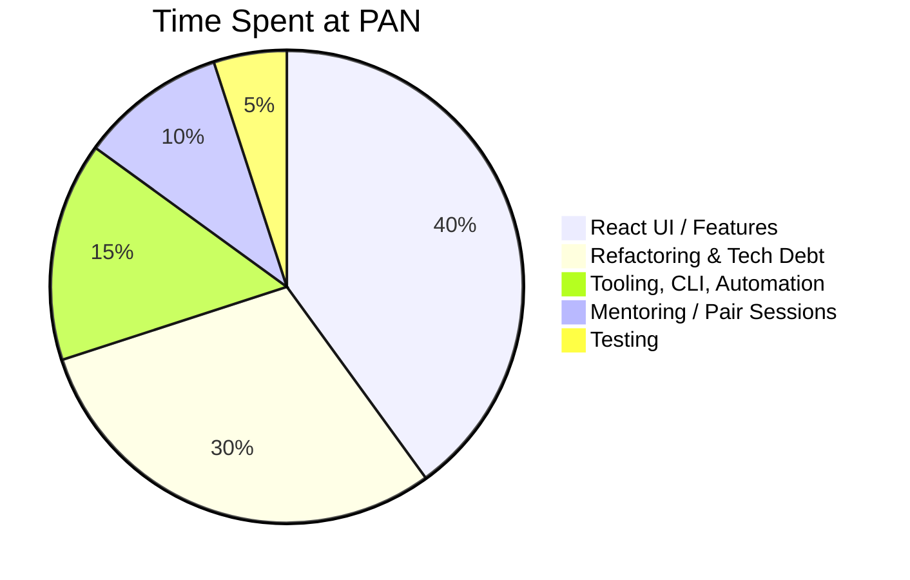
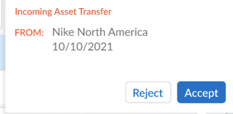
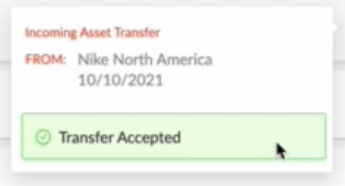
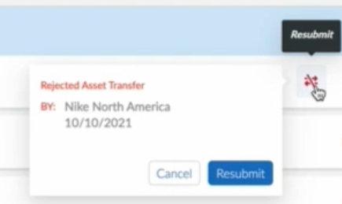
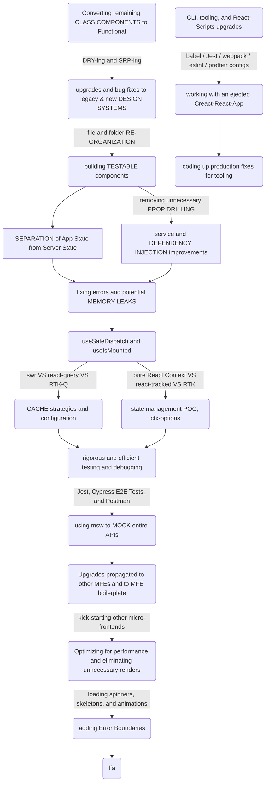

# Palo Alto Networks (PAN) — Code Samples

Code samples, demos and videos, and a detailed "post-mortem" of my time spent at Palo Alto Networks.


## 🕙 How I Spent My Time



## 💻 Code Samples

`RTK` = *Redux ToolKit* (Redux basically)

`RTK-Q` = *Redux ToolKit - Query* (data fetching, cache management)

`MFE` = *Micro-Frontend*

`msw` = *Mock Service Worker*


### RTK-Q API, Endpoints, and Auto-Generated Hooks

*  [Example #1](code-samples/rtkq/api-endpoints-and-hooks.md)


### RTK-Q Builders 

* [Example #1](code-samples/rtkq/builders/example-1.md) (Get Pending Assets - Builder)
* [Example #2](code-samples/rtkq/builders/example-2.md) (Start Transfer - Builder)


### RTK-Q Cache Updates

* [Pessimistic Example](code-samples/rtkq/cache-updates/pessimistic.md) (code fragment)
* [Optimistic Example](code-samples/rtkq/cache-updates/optimistic.md) (code fragment)

* [General (from Component) Example](code-samples/rtkq/cache-updates/general.md)  (code fragment)


### Component Examples:

* [License "Temperature Gauges"](code-samples/components/temperature-gauges.md) (simple)
* [Incoming Popover](code-samples/components/incoming-popover.md) (simple)
* [Expiration Extension CTA](code-samples/components/IEECTA.md) (with **react-query** and **Jest** unit tests)
* [Transfer Asset Drawer](code-samples/components/transfer-asset-drawer.md) (more complex, with **StoryBook** & **Cypress** testing)


### Other Javascript Examples

* ["Fetcher" Service based on `fetch`](code-samples/javascript/fetch.md) 
* ["Fetcher" Service based `axios`](code-samples/javascript/axios.md) (for `RTK-Q`)


### POC / Spike Story Examples

- [ctx-options ("Context Options") ](https://github.com/charlieargue/ctx-options)
  - GitHub repo I made showing patterns for avoiding **React Context** "over-rendering" and state management
  - 🚀**IMPACT:** 
    - Clarified a critical misunderstanding of **React Context**, causing dev leadership to bypass it unnecessarily and reach for other solutions (Redux) where it would suffice
    - Introduced a technique for optimizing performance, fixing memory leaks, and eliminating unnecessary over-renders (via [Why Did You Render](https://github.com/welldone-software/why-did-you-render) library and a mix of standard solutions like `useSafeDispatch` or removing unnecessary dispatch calls)
    - `RTK` was chosen team-wide based on this proof-of-concept, and React Context was restored as a viable and primary solution for state management (both local and global)


### Mocked API Server Examples

- [`msw` and `@mswjs/data`](code-samples/msw/msw.md) 


### CLI & Tooling Examples

- [token.js](code-samples/CLI-tooling/token.md) - automates repetitive daily developer chores
- [msw.js](code-samples/CLI-tooling/msw.md) - initializes and bootstraps `msw`  for any `MFE`


### Cypress Integration Tests

- [E2E tests and tooling](code-samples/cypress/e2e.md)


## 🎦 Demos and Videos Samples

- [MSW Video](https://github.com/charlieargue/pan-code-samples/issues/1) (<2 min)
  - Follow-up video to team documentation I wrote, on how `msw` mocking works on React MFEs 

  - *I later automated all these implementation details into the MFE CLI*

- [29 Cypress E2E](https://github.com/charlieargue/pan-code-samples/issues/2) tests running against `msw` (3.5 min)

- [Demo of Asset Transfer Flows](https://github.com/charlieargue/pan-code-samples/issues/3) (before loading animations/skeletons were added)


## 👾 Sample Cheatsheet

- Team 💙-ed this [MBP "Setup Cheatsheet"](other/mbp-setup-cheatsheet.md) I made for improved DX and productivity


## ⭐️ UI Features / Highlights


**Popover Samples:** Incoming, Outgoing, and Rejected

|  |  |
| ------------------------------------------------------------ | ------------------------------------------------------------ |
|  |  |


## 📚 Libraries I Introduced:

| Development dependencies: | Production dependencies: |
| ---- | ------------------------------------------------------------ |
| *(some removed for security)*<br />- faker<br/>- msw and @mswjs/data<br/>- RTL:<br/>  • @testing-library/react<br/>  • @testing-library/user-event<br/>  • @testing-library/cypress<br/>- cypress: <br/>  • @cypress/react<br/>  • @cypress/webpack-dev-server<br/>  • cypress-plugin-tab<br/>  - @cypress/code-coverage<br/>    • babel-plugin-istanbul<br/>    • istanbul<br/>    • istanbul-lib-coverage<br/>    • nyc<br/>- @welldone-software/why-did-you-render<br/>- husky<br />- puppeteer | - @reduxjs/toolkit (RTK-Q) |


## 🚀 Impact Areas


Legend (so one/two word "keys") up top?

Or just minimize and see if long "phrases" looks ok


### **THis is IN ORDER as it happened!** 

- [x] Converted remaining Class Components to Functional
- [x] fixing numerous bugs and upgrading both legacy and current Design Systems (built with Ant Design & styled-components)
- [x] file and folder organization, removing unnecessary prop drilling, 
- [x] building testable components
- [x] contextualizer for managing multiple contexts, view selector, Data Access Services, and global auth state
- [x] separation of state management, App State from Server State (`react-query` was chosed over `swr`, and pure React.Context for state)
- [x] service and DI (dependency injection) solutions
- [x] fixing numerous memory leaks (manually, or with custom hooks like `useSafeDispatch` or `useIsMounted`)
- [x] `msw` and `@mswjs/data` (mocking entire APIs)
- [x] cache strategies and configuration
- [x] rigorous and efficient testing and debugging (Jest, Cypress E2E Tests, and Postman)

- [x] Built POC demonstrating React Context & Cache Management patterns and best practices ([ctx-options](https://github.com/charlieargue/ctx-options), **DEC 28, 2021**)  - `RTK` was chosen based on this repo
- [x] After discussion, `react-query` was replaced with `RTK-Q` as Redux was already being used by team (and now that the need for something like `RTK-Q` was understood, refactoring begins of `react-query` to `RTK-Q`, **JAN 3, 2022**)
- [x] Upgrades implemented in other MFEs under active development, as well as in MFE boilerplate used to kick-start other micro-frontends
- [x] CLI, build tooling, and React-Scripts upgrades (working with ejected CRA and babel/Jest/webpack/eslint/prettier configurations and scripts)
- [x] ~~composing MFEs into main container MFE,~~ coding up production fixes for various tooling
- [x] Optimizing for performance, eliminating unnecessary renders
- [x] page loading spinners, skeletons, and button loading animations and work flows (preventing double-taps, etc.)
- [x] adding both local and global Error Boundaries (before app just crashed)


## Tech Debt & Refactoring Journey

A simplification highlighting key points in the path I took to successfully remove a huge amount of technical debt and refactor multiple MFEs, while simultaneously delivering much-loved new UI features:

```
      subgraph section
        C
        D
        E
        F
        G
      end
```





- [ ] 
- [ ] 
- [ ] 
- [ ] 
- [ ] ctx-options, POC repo
- [ ] refactoring to RTK-Q


### Simplified "Where to Put State" Flow Chart


### 🔥 Gantt of What I worked on and When

🔥(do a gantt chart! just timeline!) use my notes/Ops to make it super realistic!


### Testing & Mocking

- Introduced a modern **testing infrastructure** **and tooling** (`msw`, Jest, Cypress), centralized so developers could use them from any MFE (including Jest and Cypress code coverage)

- Setup next-generation **API mocking** (`msw`), that allowed effortless request interception at the network level, and seamless re-use the same mock definitions for testing, development, and debugging

- Demonstrated successful use of **Cypress E2E tests** to confidently and quickly refactor entire MFEs, to hunt/fix/prevent bugs, and as a UI unit and component testing tool (against StoryBook stories)

- Introduced Postman as a critical tool for sharing collections between BE and FE during requirements-gathering phase

- While refactoring multiple MFEs, wrote highly-testable code so that services, components, utility functions, and custom hooks could all be exercised rigorously

- Guided team on what to test and how to test (see [Testing Pyramid](https://github.com/charlieargue/multi-cart#-testing), eg. how Jest component tests should check for an even handler being called where-as E2E tests should test that a toast message appeared, etc.)

- **🚀 IMPACT:** 
  - Solved FE team's primary pain point of blockage by BE dysfunction and unstable BE environments
  - Super-charged development velocity and allowed for rapid prototyping
  - Developers stopped putting messy mocking code all over the codebases
  - Staff engineer started using Cypress/Jest/Postman/`msw` and our joint efforts led to complete adoption by the team
  - No testing was being done on my team when I arrived, and now the staff engineer and team are writing tests nearly daily and even doing occasional TDD
  - `msw/data` in particular allowed for mocked data persistence and allowed for effectively mocking entire complex workflows and building out entire features without waiting for the BE
  - Greatly improved team's capability to deliver bug-free features
  
  
  
  

### UI/UX Design Impact:

- Made the designer very happy with pixel-perfect build-outs of his Figma prototypes (thx [PerfectPixel](https://chrome.google.com/webstore/detail/perfectpixel-by-welldonec/dkaagdgjmgdmbnecmcefdhjekcoceebi?hl=en)!)
- Provided frequent useful feedback on better UI design (eg. better design of toasts and alerts for popovers in a DataTable context)
- Solved a major Data View pain-point by combining loading states for Asset Dashboard Tiles, Product Families, Search, Filters, and Data Table UI/UX, removing the need for a lot of code and buggy edge-cases (users were counter-intuitively running multiple searches at once without realizing it, resulting in race conditions, causing confusion both for users and developers)


### Mentoring to Staff Engineer 

- [ ] Provided regular guidance to my supervising **staff engineer** on the **latest** React (and general software) best practices, patterns, and trends — he  adopted almost all of my suggestions, including but not limited to:
  - [ ] Advanced use of markdown and **Typora** (a markdown editor)
  
  - [ ] having a centralized, markdown-based **"Personal Knowledge Base"** in GitHub
  
  - [ ] switching to **MBP** (and guidance on setup and optimization)
  
  - [ ] following **React community leaders** such as Kent Dobbs, Ben Awad, as patterns such as Tao of React, "Rule of Three" or "AHA Programming"
  
  - [ ] purchasing the **Epic React** and **JavaScript Testing workshops** by Kent Dobbs, upon my personal recommendation
  
  - [ ] using **Tabox** for Chrome tab group management
  
  - [ ] using **Github Desktop**
  
  - [ ] **VSCode extensions**: auto-imports, spell checker, snippets, Quokka, themes, #region folding, bookmarks, Markdown to JIRA, CODDX Kanban Board, Turbo Console Log, Auto Barrel, and others
  
  - [ ] using **VSCode keyboard short-cuts** such as: auto-order/dedupe imports, auto-formatting, navigate back/forward, etc.
  
  - [ ] fixed annoying prettier auto-format that was running each time a developer saved a file, to instead run before commits via `husky`
  
  - [ ] Tao of React, Rule of 3s, AHA Programming
  
  - [ ] separating state into two categories: App state from Server state (and not keeping everything in Redux)
  
  - [ ] successfully implementing various latest patterns and libraries for state-management, data fetching, and cache management options, including pure React Context, react-tracked, react-query, and RTK-Q (Redux was already being used)                                          
  
  - [ ] clearing up misunderstandings that caused the team to shy away from pure React Context
  
  - [ ] provided clear POC repo [ctx-options](https://github.com/charlieargue/ctx-options) to demonstrate common state management solutions and patterns for dealing with React Context over-renders
  
  - [ ] successfully pushing to setup a shared PostMan collection for the team
  
  - [ ] centralizing library exports and cheatsheets in a separate dev-tools repo
  
  - [ ] establishing caching patterns and strategies
  
  - [ ] next generation API mocking for testing and development
  
  - [ ] component-based rapid prototyping with StoryBook (and then using those stories for component UI unit tests via Cypress)
  
    
  
    
  
  

### Mentoring to Other Junior & Senior Team Members

- [ ] taking less experienced dev under my wing and helping thru frequent pair programming sessions
- [ ] guidance on entire dev workflows, specifically how to use:
  - [ ] StoryBook for **rapid UI prototyping**
  - [ ] `msw` and `@mswjs/data` for **rapid development** against a mocked API (wiring up data and behavior)
  - [ ] Postman, Jest, and Cypress for building an efficient and robust **testing pyramid**
  - [ ] other tips and best practices (see cheatsheet)


### Team Productivity & DX

- [ ] repetitive chore automation 💚 (puppeteer, saving hours of dev time, (dozens of MFEs and environments!)
  - [ ] Before & After Processes: **token automation**
- [ ] linking, starting, and msw command shortcuts (via `zsh` config)
- [ ] no more prettier sheesh! introduced husky
- [ ] VSCode extensions, chrome extensions, see MBP cheatsheet
- [ ] husky & the DISABLE_PRETTIER flag (before that, each time a developer would save their file, the prettier auto-format would run, losing their place on the screen, un-folding all folded code, and causing all sorts of other headaches)


### Future Directions

Created momentum, enthusiasm, and consensus on future architectural decisions and upgrades, such as:

- [ ] upgrading to **Next.js** (team now even considering **Remix**!)
- [ ] migrating to a **monorepo**, such as **NX**  (team now even considering **TurboRepo**!)
- [ ] running Cypress E2E tests in **CICD** via **GitHub actions** and **Cypress Dashboard** (provided .yml scripts for running E2E tests in parallel, across multiple machines)
- [ ] guidance on how to create **"Testing Sandboxes"** (by dynamically generating test roles, accounts, users, assets, etc.)
- [ ] guidance on how to setup screenshot **UI Regression Testing** (via Happo, StoryBook, and Cypress)


### Tech Debt

* ctx-options
* rtk-query / separating App State from Server State
* class -> functional components
* state pyramid (include pic like 🛍 MC)
* etc...


### Agile and Project Management

Introduced:

- proper epic and story Acceptance Criteria
- epic kick-offs (w/ design-docs for medium-to-hard stories)
- post-mortems
- 1-on-1s 


Guided project management on:

- [ ] having Retros at end of sprint instead of during sprint
- [ ] splitting FE from BE in stand-ups
- [ ] de-coupling FE from BE in stories (separate integration stories)
- [ ] keeping stand-ups short, using call-outs in JIRA and slack, and leaning out amount of meetings
- [ ] how to switch from Visual to Text editing mode
- [ ] how to use markdown auto-outlining syntax
- [ ] what is an epic, how to write Acceptance Criteria, etc.
- [ ] benefits of markdown, mocking API servers, creating sub-tasks (of stories), linking issues, sharing Postman collections, and more
- [ ] lessening the amount of meetings (amount was affecting the team's development productivity)


# Testimonials & Feedback


### Feedback after First Demo  `FRI Jan 21`:

|  |  |
| ------------------------------------------------------------ | ------------------------------------------------------------ |


- [ ] 

  

- [ ] HF:

  - [ ] BTW, I gave you the most exciting feature that I believe will be used by a lot of customers, CSP-10112 :).

- [ ] pics

- [ ] see all 1-on-1s !!!!! (.md)

  - [ ] `Wed Dec 8, 2021` - see **iphone recording** from same day

  - [ ] > one or two other candidates hired along with me got kicked out already! I'm doing great! so far doing good, ...  keep it up!

- [ ] audio (iphone), 

  - [ ] 🔥 esp.  entire Mazen VIP recording plz asap! (from **Thur, Feb 10, 2022**)

- [ ] GINA said some good things about me! See the loom (and check on my phone!)

- [ ] transcripts/quotes/blurbs

  - [ ] PR's 100%, no bugs, refactored entire MFE w/i 1 month of being there, no bugs/revisions from QA/UAT!

- [ ] Show Alex's: `all good questions` from [JIRA pic](ALEX-2-Screen Shot 2022-02-14 at 2.15.29 PM.png)

- [ ] 

  

# 🗣 Testimonials / Feedback


🔥 See #iphone recordings with Mazen (Accomplishment one, right before SPUI Part 1/2/3)


## 𝚫 Reasons for Transition

- [ ] Lots of chaos with the meeting, cancelled and re-scheduled last minute… :)
- [ ] 
