# Palo Alto Networks (PAN) — Code Samples

Code samples, demos and videos, and a detailed "post-mortem" and case study of my time spent at Palo Alto Networks.


## 🕙 How I Spent My Time


## 💻 Code Samples

`RTK` = *Redux ToolKit* (Redux basically)

`RTK-Q` = *Redux ToolKit - Query* (data fetching, cache management)

`MFE` = *Micro-Frontend*

`msw` = *Mock Service Worker*


### RTK-Q API, Endpoints, and Auto-Generated Hooks

*  [Example #1](code-samples/rtkq/api-endpoints-and-hooks.md)


### RTK-Q Builders 

* [Example #1](code-samples/rtkq/builders/example-1.md) (Get Pending Assets - Builder)
* [Example #2](code-samples/rtkq/builders/example-2.md) (Start Transfer - Builder)


### RTK-Q Cache Updates

* [Pessimistic Example](code-samples/rtkq/cache-updates/pessimistic.md) (code fragment)
* [Optimistic Example](code-samples/rtkq/cache-updates/optimistic.md) (code fragment)

* [General (from Component) Example](code-samples/rtkq/cache-updates/general.md)  (code fragment)


### Component Examples:

* [License "Temperature Gauges"](code-samples/components/temperature-gauges.md) (simple)
* [Incoming Popover](code-samples/components/incoming-popover.md) (simple)
* [Expiration Extension CTA](code-samples/components/IEECTA.md) (with **react-query** and **Jest** unit tests)
* [Transfer Asset Drawer](code-samples/components/transfer-asset-drawer.md) (more complex, with **StoryBook** & **Cypress** testing)


### Other Javascript Examples

* ["Fetcher" Service based on `fetch`](code-samples/javascript/fetch.md) 
* ["Fetcher" Service based `axios`](code-samples/javascript/axios.md) (for `RTK-Q`)


### POC / Spike Story Examples

- [ctx-options ("Context Options") ](https://github.com/charlieargue/ctx-options)
  - GitHub repo I made showing patterns for avoiding **React Context** "over-rendering" and state management
  - 🚀**IMPACT:** 
    - Clarified a critical misunderstanding of **React Context**, causing dev leadership to bypass it unnecessarily and reach for other solutions (Redux) where it would suffice
    - Introduced a technique for optimizing performance, fixing memory leaks, and eliminating unnecessary over-renders (via [Why Did You Render](https://github.com/welldone-software/why-did-you-render) library and a mix of standard solutions like `useSafeDispatch` or removing unnecessary dispatch calls)
    - `RTK` was chosen team-wide based on this proof-of-concept, and React Context was restored as a viable and primary solution for state management (both local and global)


### Mocked API Server Examples

- [`msw` and `@mswjs/data`](code-samples/msw/msw.md) 


### CLI & Tooling Examples

- [token.js](code-samples/CLI-tooling/token.md) - automates repetitive daily developer chores
- [msw.js](code-samples/CLI-tooling/msw.md) - initializes and bootstraps `msw`  for any `MFE`


### Cypress Integration Tests

- [E2E tests and tooling](code-samples/cypress/e2e.md)


## 🎦 Demos and Videos Samples

- [MSW Video](https://github.com/charlieargue/pan-code-samples/issues/1) (<2 min)
  - Follow-up video to team documentation I wrote, on how `msw` mocking works on React MFEs 

  - *I later automated all these implementation details into the MFE CLI*

- [29 Cypress E2E](https://github.com/charlieargue/pan-code-samples/issues/2) tests running against `msw` (3.5 min)

- [Demo of Asset Transfer Flows](https://github.com/charlieargue/pan-code-samples/issues/3) (before loading animations/skeletons were added)


## 👾 Sample Cheatsheet

- Team 💙-ed this [MBP "Setup Cheatsheet"](other/mbp-setup-cheatsheet.md) I made for improved DX and productivity


## ⭐️ UI Features / Highlights


**Popover Samples:** Incoming, Outgoing, and Rejected

|  |  |
| ------------------------------------------------------------ | ------------------------------------------------------------ |
|  |  |


## 📚 Libraries I Introduced:

| Development dependencies: | Production dependencies: |
| ---- | ------------------------------------------------------------ |
| *(some removed for security)*<br />- faker<br/>- msw and @mswjs/data<br/>- RTL:<br/>  • @testing-library/react<br/>  • @testing-library/user-event<br/>  • @testing-library/cypress<br/>- cypress: <br/>  • @cypress/react<br/>  • @cypress/webpack-dev-server<br/>  • cypress-plugin-tab<br/>  - @cypress/code-coverage<br/>    • babel-plugin-istanbul<br/>    • istanbul<br/>    • istanbul-lib-coverage<br/>    • nyc<br/>- @welldone-software/why-did-you-render<br/>- husky<br />- puppeteer | - @reduxjs/toolkit (RTK-Q) |


## 📝 Sample Design Documents

Fragment from a `Hi-Level Design Doc` of all Asset Transfer workflows, helping to illustrate clearly:

* `Source` VS `Destination` users
* which MFE the action or event occurs in, i.e. ⏸ **`CPT`** VS 🛡 **`NS`** 
* and current limitations (`FUTURE ENHANCEMENTS`)


## 🚀 Positive Impact 


### Testing & Mocking

- Introduced a modern **testing infrastructure** **and tooling** (`msw`, Jest, Cypress), centralized so developers could use them from any MFE (including Jest and Cypress code coverage)

- Setup next-generation **API mocking** (`msw`), that allowed effortless request interception at the network level, and seamless re-use the same mock definitions for testing, development, and debugging

- Demonstrated successful use of **Cypress E2E tests** to confidently and quickly refactor entire MFEs, to hunt/fix/prevent bugs, and as a UI unit and component testing tool (against StoryBook stories)

- Introduced Postman as a critical tool for sharing collections between BE and FE during requirements-gathering phase

- While refactoring multiple MFEs, wrote highly-testable code so that services, components, utility functions, and custom hooks could all be exercised rigorously

- Guided team on what to test and how to test (see [Testing Pyramid](https://github.com/charlieargue/multi-cart#-testing), eg. how Jest component tests should check for an even handler being called where-as E2E tests should test that a toast message appeared, etc.)

- **🚀 IMPACT:** 
  - Solved FE team's primary pain point of blockage by BE dysfunction and unstable BE environments
  - Super-charged development velocity and allowed for rapid prototyping
  - Developers stopped putting messy mocking code all over the codebases
  - Staff engineer started using Cypress/Jest/Postman/`msw` and our joint efforts led to complete adoption by the team
  - No testing was being done on my team when I arrived, and now the staff engineer and team are writing tests nearly daily and even doing occasional TDD
  - `msw/data` in particular allowed for mocked data persistence and allowed for effectively mocking entire complex workflows and building out entire features without waiting for the BE
  - Greatly improved team's capability to deliver bug-free features
  
  
  
  

### UI/UX Design Impact:

- Made the designer very happy with pixel-perfect build-outs of his Figma prototypes (thx [PerfectPixel](https://chrome.google.com/webstore/detail/perfectpixel-by-welldonec/dkaagdgjmgdmbnecmcefdhjekcoceebi?hl=en)!)
- Provided frequent useful feedback on better UI design (eg. better design of toasts and alerts for popovers in a DataTable context)
- Solved a major Data View pain-point by combining loading states for Asset Dashboard Tiles, Product Families, Search, Filters, and Data Table UI/UX, removing the need for a lot of code and buggy edge-cases (users were counter-intuitively running multiple searches at once without realizing it, resulting in race conditions, causing confusion both for users and developers)


### Mentoring to Staff Engineer 

- [ ] Provided regular guidance to my supervising **staff engineer** on the **latest** React (and general software) best practices, patterns, and trends — he  adopted almost all of my suggestions, including but not limited to:
  - [ ] Advanced use of markdown and **Typora** (a markdown editor)
  
  - [ ] having a centralized, markdown-based **"Personal Knowledge Base"** in GitHub
  
  - [ ] switching to **MBP** (and guidance on setup and optimization)
  
  - [ ] following **React community leaders** such as Kent Dodds, Ben Awad, as patterns such as Tao of React, "Rule of Three" or "AHA Programming"
  
  - [ ] purchasing the **Epic React** and **JavaScript Testing workshops** by Kent Dodds, upon my personal recommendation
  
  - [ ] using **Tabox** for Chrome tab group management
  
  - [ ] using **Github Desktop**
  
  - [ ] **VSCode extensions**: auto-imports, spell checker, snippets, Quokka, themes, #region folding, bookmarks, Markdown to JIRA, CODDX Kanban Board, Turbo Console Log, Auto Barrel, and others
  
  - [ ] using **VSCode keyboard short-cuts** such as: auto-order/dedupe imports, auto-formatting, navigate back/forward, etc.
  
  - [ ] fixed annoying prettier auto-format that was running each time a developer saved a file, to instead run before commits via `husky`
  
  - [ ] Tao of React, Rule of 3s, AHA Programming
  
  - [ ] separating state into two categories: App state from Server state (and not keeping everything in Redux)
  
  - [ ] successfully implementing various latest patterns and libraries for state-management, data fetching, and cache management options, including pure React Context, react-tracked, react-query, and RTK-Q (Redux was already being used)                                          
  
  - [ ] clearing up misunderstandings that caused the team to shy away from pure React Context
  
  - [ ] provided clear POC repo [ctx-options](https://github.com/charlieargue/ctx-options) to demonstrate common state management solutions and patterns for dealing with React Context over-renders
  
  - [ ] successfully pushing to setup a shared PostMan collection for the team
  
  - [ ] centralizing library exports and cheatsheets in a separate dev-tools repo
  
  - [ ] establishing caching patterns and strategies
  
  - [ ] next generation API mocking for testing and development
  
  - [ ] component-based rapid prototyping with StoryBook (and then using those stories for component UI unit tests via Cypress)
  
    
  
    
  
  

### Mentoring to Other Junior & Senior Team Members

- [ ] taking less experienced dev under my wing and helping thru frequent pair programming sessions
- [ ] guidance on entire dev workflows, specifically how to use:
  - [ ] StoryBook for **rapid UI prototyping**
  - [ ] `msw` and `@mswjs/data` for **rapid development** against a mocked API (wiring up data and behavior)
  - [ ] Postman, Jest, and Cypress for building an efficient and robust **testing pyramid**
  - [ ] other tips and best practices (see cheatsheet)


### Team Productivity & DX

- [ ] repetitive chore automation 💚 (puppeteer, saving hours of dev time, (dozens of MFEs and environments!)
  - [ ] Before & After Processes: **token automation**
- [ ] linking, starting, and msw command shortcuts (via `zsh` config)
- [ ] no more prettier sheesh! introduced husky
- [ ] VSCode extensions, chrome extensions, see MBP cheatsheet
- [ ] husky & the DISABLE_PRETTIER flag (before that, each time a developer would save their file, the prettier auto-format would run, losing their place on the screen, un-folding all folded code, and causing all sorts of other headaches)
- [ ] using [loom](https://www.loom.com/) videos to quickly and easily communicate status updates on features, and much more


### Future Directions

Created momentum, enthusiasm, and consensus on future architectural decisions and upgrades, such as:

- [ ] upgrading to **Next.js** (team now even considering **Remix**!)
- [ ] migrating to a **monorepo**, such as **NX**  (team now even considering **TurboRepo**!)
- [ ] running Cypress E2E tests in **CICD** via **GitHub actions** and **Cypress Dashboard** (provided .yml scripts for running E2E tests in parallel, across multiple machines)
- [ ] guidance on how to create **"Testing Sandboxes"** (by dynamically generating test roles, accounts, users, assets, etc.)
- [ ] guidance on how to setup screenshot **UI Regression Testing** (via Happo, StoryBook, and Cypress)


### Tech Debt

* ctx-options
* rtk-query / separating App State from Server State
* class -> functional components
* state pyramid (include pic like 🛍 MC)
* etc...


### Agile and Project Management

Introduced:

- proper Acceptance Criteria
- epic kick-offs (w/ design-docs for medium-to-hard stories)
- post-mortems
- 1-on-1s 


Guided project management on:

- [ ] having Retros at end of sprint instead of during sprint
- [ ] NOT re-defining Stand-ups (they wanted to change them to be normalized around features instead of team members)
- [ ] splitting FE from BE in stand-ups
- [ ] de-coupling FE from BE in stories (separate integration stories)
- [ ] keeping stand-ups short, using call-outs in JIRA and slack, and leaning out amount of meetings
- [ ] how to switch from Visual to Text editing mode
- [ ] how to use markdown auto-outlining syntax
- [ ] what is an epic, how to write Acceptance Criteria, etc.
- [ ] how to attach images inline (and not at bottom) of description
- [ ] how to insert markdown tables and formatted code blocks
- [ ] benefits of markdown, mocking API servers, creating sub-tasks (of stories), linking issues, sharing Postman collections, and more
- [ ] lessening the amount of meetings (amount was affecting the team's development productivity)
- [ ] guidance on ceremonies: when and how to have/do Sprint Planning


## 📊 Other Resources


### Tech Debt & Refactoring Journey

A simplified flow-chart highlighting key points in the path I took to successfully remove a huge amount of technical debt and refactor multiple MFEs, while simultaneously delivering much-loved new UI features:


### Simplified "Where to Put State" Flow Chart

Inspired by [Kent Dodds' decision tree chart](https://kentcdodds.com/blog/state-colocation-will-make-your-react-app-faster#so-how-do-you-decide-where-to-put-state):


### My "JIRA Process" 

From a FE Perspective:

```mermaid
graph TD
      A(("🎽 Start with an EPIC")) --> B("🏋️‍♀️Medium-to-hard sprint points need a short DESIGN DOC")
      B --> |"🎨 UI/UX Figma, prototypes, hand-offs"| C("📌 `PIN POINTS` mapping each endpoint to UI/UX")
      C --> D("📬 POSTMAN  endpoints, payloads, etc.")
      D ==> |if design doc exists| E{"🖋 Team sign-off on design doc"}
      E --> |Assign to team members| F("🪓  Break into STORIES, write full AC/requirements, weigh points")
      F --> |FE, BE, PROXY, INTEGRATION stories| G("🖨 Clone stories as needed for team")
      G --> |Use JIRA templates I provided| GG("🔪 Break stories into SUB-TASKS, if needed")
      GG --> |"🗣 Shout-outs on any blockers"| H("👷‍♂️👷‍♀️ Development work ...🚧")
      H --> |Finalize any stubbed-out Postman endpoints| GG
```




### My "Testing Pyramid"


### "Napkin Sketch" of Testing & Prototyping Pyramid for PAN


### Example of Clear Communication (in JIRA)


### Effective Use of Redux Dev-Tools and Profiler:


# Testimonials & Feedback

`Mazen Ghalayini` — Staff React Engineer, Direct Supervisor ([LinkedIn](https://www.linkedin.com/in/mazen-g-a76139179/), mghalayini@paloaltonetworks.com)

`Hanford Choy` — Non-Technical Project Manager (hchoy@paloaltonetworks.com)

`Alexander Jones` — Team Head Designer ([LinkedIn](https://www.linkedin.com/in/alexander-jones7/), aljones@paloaltonetworks.com)

`Palak Mehrotra` — Senior Software Engineer ([LinkedIn](https://www.linkedin.com/in/palakmehrotra/))


### Feedback after First Demo 

 `Jan 21, 2022` (*from #slack*)

|  |  |
| ------------------------------------------------------------ | --------------------------------------- |


### Feedback from Project Management


> "BTW, I gave you the most exciting feature that I believe will be used by a lot of customers :)."  — *Hanford Choy*,  `Feb 1, 2022`


### Feedback from Supervising Staff Engineers

> "You're doing great!" [<u>re</u>: performance review] — *Mazen Ghalayini* `Feb 15, 2022`
>
> "Alright, let's give it a shot and see how that works!" [<u>re</u>: creating a shared Postman collection between FE and BE teams]
>
> — *Mazen Ghalayini*,  `Feb 22, 2022`
>
> "...you know, also, ... we're kind of under siege from [a lot of directions]... so yeah, I think your suggestion is a good one that we need to try..."  [<u>re</u>: to do a backend POC using GraphQL] — *Vish Ramamurthy*,  `Feb 23, 2022`


### Feedback from Designer

> "You're selling it, that's exactly what I'm looking for!" [re: toast notifications, popover messaging, and row highlighting proposals] 
>
> — *Alexander Jones* `Feb 23, 2022`


### Feedback from BE Team

> "I agree with Karl, actually." [<u>re</u>: my clarifying Big Query vs MySQL confusion on Asset Transfer epic] — *Palak Mehrotra* `Feb 23, 2022`


- [ ] 

  

- [ ] see all 1-on-1s !!!!! (.md)

  - [ ] `Wed Dec 8, 2021` - see **iphone recording** from same day

  - [ ] > one or two other candidates hired along with me got kicked out already! I'm doing great! so far doing good, ...  keep it up!

- [ ] audio (iphone), 

  - [ ] 🔥 esp.  entire Mazen VIP recording plz asap! (from **Thur, Feb 10, 2022**)

- [ ] GINA said some good things about me! See the loom (and check on my phone!)

- [ ] transcripts/quotes/blurbs

  - [ ] PR's 100%, no bugs, refactored entire MFE w/i 1 month of being there, no bugs/revisions from QA/UAT!

- [ ] Show Alex's: `all good questions` from [JIRA pic](ALEX-2-Screen Shot 2022-02-14 at 2.15.29 PM.png)

  

# 🗣 Testimonials / Feedback


🔥 See #iphone recordings with Mazen (Accomplishment one, right before SPUI Part 1/2/3)


# ⏳ Reasons for Transition

- [ ] Hanford / pm and "we decided to re-define what an epic is: an epic is a sub-task now"
- [ ] BE and PM dysfunction with no hope of course-correction in any reasonable amount of time
- [ ] Mazen Ghalayini (things like his code for incrementally refactoring from pixels to rem):

```js 
// file: /src/utils/units.js

// EXAMPLE USAGE: `padding: ${units[30]};`

// 🔴 BEFORE:       
export default {
    0: '0',
    1: '1px',
    2: '2px',
    3: '3px',
    4: '4px',
    6: '6px',
    7: '7px',
    8: '8px',
    9: '9px',
    10: '10px',
    11: '11px',
    12: '12px',
    14: '14px',
    15: '15px',
    16: '16px',
    17: '17px',
    18: '18px',
    20: '20px',
    22: '22px',
    24: '24px',
    25: '25px',
    28: '28px',
    29: '29px',
    30: '30px',
    32: '32px',
    33: '33px',
    35: '35px',
    36: '36px',
    40: '40px',
    44: '44px',
    48: '48px',
    56: '56px',
    64: '64px',
    72: '72px',
    76: '76px',
    80: '80px',
    96: '96px',
    112: '112px',
    128: '128px',
    144: '144px',
    160: '160px',
    168: '168px',
    176: '176px',
    184: '184px',
    192: '192px',
    208: '208px',
    222: '222px',
    224: '224px',
    240: '240px',
    250: '250px',
    255: '255px',
    256: '256px',
    270: '270px',
    288: '288px',
    320: '320px',
    350: '350px',
    450: '450px',
    384: '384px',
    541: '541px',
  
  	// 🔴 etc... so if a you, for example, needed a width of 542px or a line-height of 31px in a MFE, you had to go here and add that line explicitly, and re-link the repo so you could use it in a MFE
};

// ✅ AFTER: 
// I proposed refactoring this file to a function instead of a never-ending object map, like so:
const remCalc = (pixelValue) => {
   // for now: 
   return pixelValue === 0 ? '0' : `'${value}px'`;
   // then later: pixelValue / x = rems ...
   // and much later: just use rems ... (once legacy ASP.NET CSS issue refactored)
};
```

