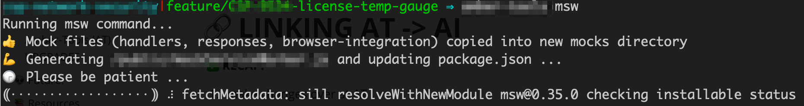

# Initializing and bootstrapping MSW


### Terminal Screen Shots




### Code Samples

###### msw.js

```js 
'use strict';
const fs = require('fs');
const ncp = require('ncp').ncp;
const path = require('path');
const execSync = require('child_process').execSync;
const targetDirectory = fs.realpathSync(process.cwd());
const editIndexJsRender = require('./utils/editIndexJsRender');
const os = require('os');

process.env.BABEL_ENV = 'development';
process.env.NODE_ENV = 'development';
process.env.REACT_APP_MSW = 'on';

process.on('unhandledRejection', (err) => {
    throw err;
});

require('../config/env');

// ##################################################################################
// # MSW init and START w/ MSW 'on'
// ##################################################################################
(async () => {
    try {
        await createMocksFiles();
        mswInit();
        await mswBootstrapping();
        await addGitIgnoreSW();
        mswOnAndStart()
    } catch (err) {
        if (err && err.message) {
            console.log(err.message);
        }
        process.exit(1);
    }

})();

// ------------------------
function createMocksFiles() {
    return new Promise((resolve, reject) => {
        ... // SANITIZED
        if (!fs.existsSync(targetMocksDirectory)) {
            return ncp(sourceMocksTemplateDirectory, targetMocksDirectory, function (err) {
                if (err) {
                    console.error(err);
                    return reject(err);
                }
                console.log(`👍 Mock files (handlers, responses, browser-integration) copied into new mocks directory`);
                return resolve();
            });
        }
        return resolve();
    });
}

// ------------------------
function mswInit() {
    ... // SANITIZED
    const mswFile = path.resolve(publicDirectory, MSW_FILENAME);
    if (!fs.existsSync(mswFile)) {
        console.log(`💪 Generating /public/${MSW_FILENAME} and updating package.json ...`);
        console.log(`🕞 Please be patient ...`);
        execSync(MSW_INIT_CMD, { stdio: 'inherit' });
    }
}

// ------------------------
async function mswBootstrapping() {
    ... // SANITIZED
    if (fs.existsSync(indexFile)) {
        await editIndexJsRender(indexFile);
    } else {
        throw new Error(`🛑 Uh-oh, could not find /src/${INDEX_FILENAME}, could not install msw bootstrapping code... ABORTING...`);
    }
}

// ------------------------
function addGitIgnoreSW() {
    return new Promise((resolve, reject) => {
        ... // SANITIZED
        fs.readFile(gitIgnoreFile, function (err, data) {
            if (err) {
                console.error(err);
                return reject(err);
            }
            if (data.includes(GITIGNORE_TXT)) {
                return resolve();
            }
            return fs.appendFile(gitIgnoreFile, GITIGNORE_TXT, function (err) {
                if (err) {
                    console.error(err);
                    return reject(err);
                }
                return resolve();
            });
        });
    });
}

// ------------------------
function mswOnAndStart() {
    const START_WITH_MSW_CMD = 'lorem-ipsum start';
    execSync(START_WITH_MSW_CMD, { stdio: 'inherit' });
}
```