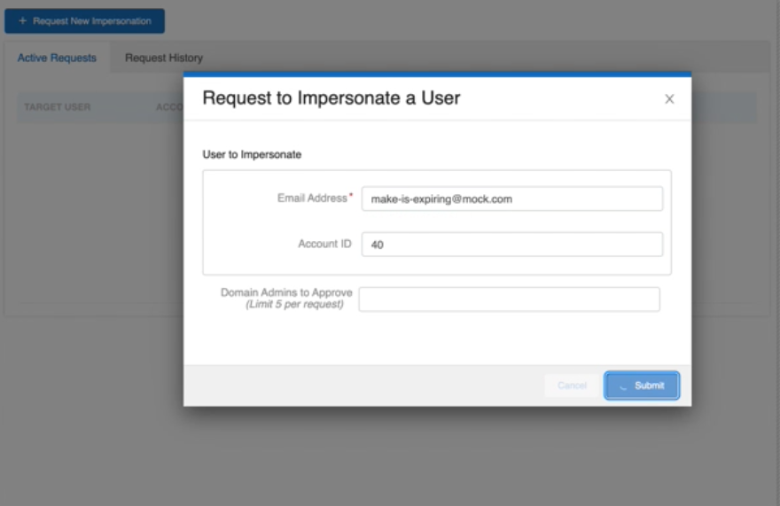
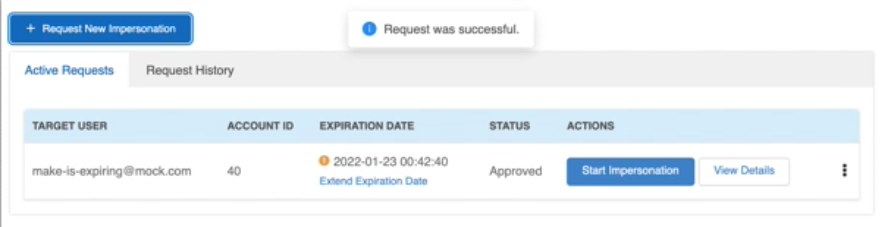

# Expiration Extension CTA


### UI Screen Shots






### Code Samples

###### ExpirationExtensionCTA.jsx

```jsx  
import { Button, WarnIcon } from '@Lorem/Ipsum';
import PropTypes from 'prop-types';
import React from 'react';
import { useExtendExpiration } from '../../hooks/react-query';

// ##################################################################################
// # Impersonation Expiration EXTENSION Call-to-Action
// ##################################################################################
export const ImpersonationExpirationExtensionCTA = ({ expiredDate, requestId, clickHandler }) => {
    const { isLoading, extendExpirationDate } = useExtendExpiration(requestId);
    return (
        <div className='btn-impersonation-extend'>
            <div>
                <WarnIcon className='warn-icon' />
                {expiredDate}
            </div>
            <Button type='link' loading={isLoading} onClick={clickHandler || extendExpirationDate}>
                Extend Expiration Date
            </Button>
        </div>
    );
};

ImpersonationExpirationExtensionCTA.propTypes = {
    requestId: PropTypes.string,
    expiredDate: PropTypes.string,
    clickHandler: PropTypes.func,
};

export default ImpersonationExpirationExtensionCTA;
```


###### useExtendExpiration (react-query custom hook and cache updating)

```js 
import { Message } from '@Lorem/Ipsum';
import { useMutation, useQueryClient } from 'react-query';
import { APP_ACTION_TYPES, MESSAGE_DISPLAY_DURATION, REACT_QUERY_OPTIONS } from '../../constants';
import { handleError } from '../../utils/utils';
import { useModalState } from '../useModalState';
import { useServiceHub } from '../useServiceHub';

// ##################################################################################
// # USE EXTEND EXPIRATION
//
// USAGE: `const { isLoading, error, extendExpirationDate } = useExtendExpiration('12cefe31-lorem-ipsum');`
// ##################################################################################
export const useExtendExpiration = requestId => {
    const queryClient = useQueryClient();
    const srvcHub = useServiceHub();
    const das = srvcHub.DAS;
    const { modalStateDispatch } = useModalState();

    // ------------------------
    const { isLoading, error, isError, mutate } = useMutation(
        ['extendExpirationDate', requestId],
        () => das.extendExpirationDate(requestId),
        {
            ...REACT_QUERY_OPTIONS,
        },
    );

    // ------------------------
    const extendExpirationDate = async () => {
        await mutate(null, {
            onSuccess: response => {
                Message.info('Request was successful.', MESSAGE_DISPLAY_DURATION);
                queryClient.setQueriesData(['activeRequests'], cachedActiveRequests => {
                    const newCachedData = cachedActiveRequests.map(data => {
                        if (data.requestId === requestId) {
                            const clone = { ...data };
                            delete clone.isExpiring;
                            return {
                                ...clone,
                                expirationDate: response.expirationDate,
                            };
                        }
                        return data;
                    });
                    return newCachedData;
                });
                queryClient.invalidateQueries({
                    queryKey: ['activeRequests'],
                    refetchActive: false,
                });
            },
        });
    };

    // ------------------------
    if (isError) {
        handleError(isError);
        modalStateDispatch({
            type: APP_ACTION_TYPES.SET_MODAL_STATE,
            newState: {
                requestModalAlert: {
                    type: 'error',
                    message: error.message,
                    isOnTop: false,
                },
            },
        });
    }

    // ------------------------
    return { isLoading, extendExpirationDate };
};

export default { useExtendExpiration };
```

