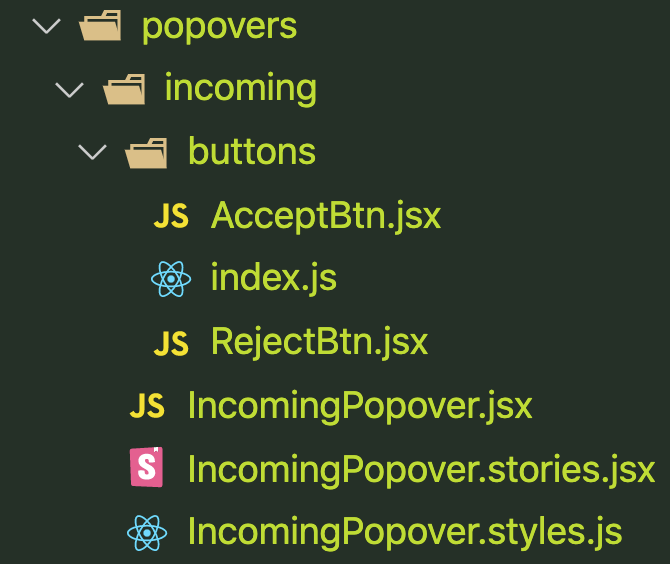
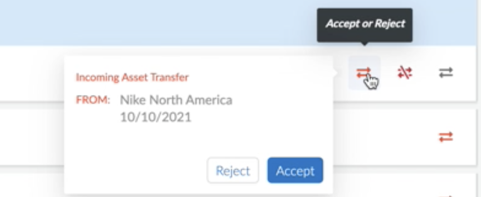

# Incoming Popover


### File Organization




### UI Screen Shots




### Code Samples:

IncomingPopover.jsx

```jsx
import { formatDate, Popover } from '@paloaltonetworks/ethos';
import { PropTypes as PT } from 'prop-types';
import React, { useState } from 'react';
import { useDispatch, useSelector } from 'react-redux';
import { DATE_MM_DD_YYYY_SLASH, PO_ALERT_TIMEOUT } from '../../../constants';
import {
    useLazyAcceptTransferQuery,
    useLazyRejectTransferQuery,
} from '../../../hooks/rtkq-endpoints-and-hooks';
import { api } from '../../../rtkq/api';
import { DefinitionList, Description, SubTitle } from '../../common/DefinitionList';
import { Title } from '../../common/Title';
import { AcceptBtn, RejectBtn } from './buttons';
import { StyledAlert, StyledContent, StyledSpace } from './IncomingPopover.styles';

const ALERT_VISIBILITY_STATES = {
    NOTHING: 0,
    ACCEPTED_ALERT: 1,
    REJECTED_ALERT: 2,
};

// ##################################################################################
// ACCEPT | REJECT popover (PO)
// ##################################################################################
export const IncomingPopover = ({
    children,
    deviceTransferId,
    deviceTransferBeginDate,
    fromUserDisplayName,
}) => {
    const dispatch = useDispatch();
    const [poVisibility, setPOVisibility] = useState(false);
    const [alertVisibility, setAlertVisibility] = useState(ALERT_VISIBILITY_STATES.NOTHING);
    const { userAccountId, supportAccountId } = useSelector((state) => state.auth);
    const [triggerAccept, resultAccept] = useLazyAcceptTransferQuery();
    const [triggerReject, resultReject] = useLazyRejectTransferQuery();

    // --------------
    const onAcceptClick = async () => {
        await triggerAccept({ userAccountId, supportAccountId, deviceTransferId });
        setAlertVisibility(ALERT_VISIBILITY_STATES.ACCEPTED_ALERT);
        setTimeout(() => {
            dispatch(
                api.util.updateQueryData(
                    'getPendingAssets',
                    { userAccountId, supportAccountId },
                    (drafts) => {
                        drafts.splice(
                            drafts.findIndex(
                                (draft) => draft.device_transfer_id === deviceTransferId,
                            ),
                            1,
                        );
                    },
                ),
            );
        }, PO_ALERT_TIMEOUT);
    };

    // --------------
    const onRejectClick = async () => {
        await triggerReject({ userAccountId, supportAccountId, deviceTransferId });
        setAlertVisibility(ALERT_VISIBILITY_STATES.REJECTED_ALERT);
        setTimeout(() => {
            dispatch(
                api.util.updateQueryData(
                    'getPendingAssets',
                    { userAccountId, supportAccountId },
                    (drafts) => {
                        drafts.splice(
                            drafts.findIndex(
                                (draft) => draft.device_transfer_id === deviceTransferId,
                            ),
                            1,
                        );
                    },
                ),
            );
        }, PO_ALERT_TIMEOUT);
    };

    const Content = () => (
        <StyledContent>
            <Title>Incoming Asset Transfer</Title>
            <DefinitionList>
                <SubTitle>FROM:</SubTitle>
                <Description>
                    {fromUserDisplayName}
                    <br />
                    {formatDate(DATE_MM_DD_YYYY_SLASH, new Date(deviceTransferBeginDate))}
                </Description>
            </DefinitionList>

            {alertVisibility === ALERT_VISIBILITY_STATES.NOTHING && (
                <StyledSpace direction='horizontal' align='end'>
                    <RejectBtn
                        onRejectClick={onRejectClick}
                        loading={resultReject.isFetching}
                        disabled={resultAccept.isFetching}
                    />
                    <AcceptBtn
                        onAcceptClick={onAcceptClick}
                        loading={resultAccept.isFetching}
                        disabled={resultReject.isFetching}
                    />
                </StyledSpace>
            )}

            {alertVisibility === ALERT_VISIBILITY_STATES.ACCEPTED_ALERT && (
                <StyledAlert type='success' description='Transfer Accepted' showIcon />
            )}
            {alertVisibility === ALERT_VISIBILITY_STATES.REJECTED_ALERT && (
                <StyledAlert type='error' description='Transfer Rejected' showIcon />
            )}
        </StyledContent>
    );

    return (
        <Popover
            placement='leftTop'
            trigger='click'
            visible={poVisibility}
            content={<Content />}
            onVisibleChange={(v) => {
                setPOVisibility(v);
            }}>
            {React.cloneElement(children, { setVisibility: setPOVisibility })}
        </Popover>
    );
};

IncomingPopover.propTypes = {
    children: PT.node,
    deviceTransferId: PT.number,
    deviceTransferBeginDate: PT.string,
    fromUserDisplayName: PT.string,
};

export default IncomingPopover;
```


IncomingPopover.styles.js

```jsx  
import { Space, units, Alert } from '@paloaltonetworks/ethos';
import styled from 'styled-components';

export const StyledContent = styled.div`
    width: 222px;
    height: 105px;
    padding: 0;
    margin-left: -5px;
    letter-spacing: 0;
`;
export const StyledSpace = styled(Space)`
    float: right;
    margin-right: -7px;
    padding-top: 22px;

    & button span {
        font-weight: 300;
    }
`;
export const StyledAlert = styled(Alert)`
    width: 236px;
    height: 36px;
    margin-left: -3px;
    margin-top: 12px;
    
    & .ant-alert-icon {
        margin-left: -4px;
    }
    
    ${'' /* 
    +------------------+
    | Icon             |
    +------------------+
    | Content          |
    |   Description    |
    +------------------+
     */
    }

    & .ant-alert-content {
        margin-left: -9px;
    }
    & .ant-alert-description {
        line-height: 12px;
    }
`;
```


IncomingPopover.stories.jsx

```jsx  
import { colors, Space } from '@paloaltonetworks/ethos';
import React from 'react';
import { IncomingPopover } from './IncomingPopover';
import { HoverablePlugin } from '../../assets/PendingTable/HoverablePlugin';

export default {
    title: 'Asset Transfer Popovers',
    component: IncomingPopover,
};

const Template = (args) => (
    <Space align='end' direction='horizontal'>
        <IncomingPopover>
            <HoverablePlugin
                icon='Exchange'
                iconColor={colors.grey[60]}
                toolTip={<strong>Accept or Reject</strong>}
                toolTipPosition='bottom'
            />
        </IncomingPopover>
    </Space>
);

export const Primary = Template.bind({});
Primary.args = {
    primary: true,
    label: 'IncomingPopover',
};
```


AcceptBtn.jsx

```jsx  
import { Button } from '@paloaltonetworks/ethos';
import { PropTypes as PT } from 'prop-types';
import React from 'react';

// ##################################################################################
// ACCEPT button
// ##################################################################################
export const AcceptBtn = ({ onAcceptClick, ...props }) => {
    return (
        <Button size='small' type='primary' onClick={onAcceptClick} {...props}>
            Accept
        </Button>
    );
};

AcceptBtn.propTypes = {
    onAcceptClick: PT.func,
};

export default AcceptBtn;
```

