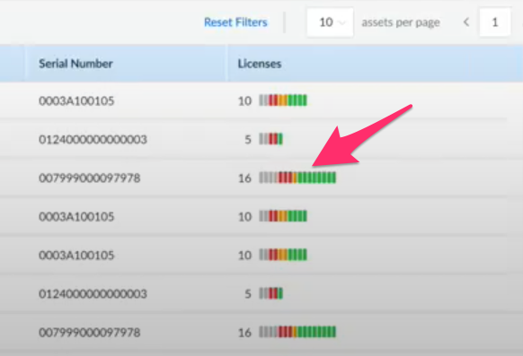

# License "Temperature Gauges"


### UI Screen Shot




### Code Samples

###### LicenseTemperatureGauges.jsx

```jsx
import { colors, units } from '@Lorem/Ipsum';
import PropTypes from 'prop-types';
import React from 'react';
import styled from 'styled-components';

import { LICENSE_STATUS } from '../../../constants';
import { sortLicensesByStatusThenByDate } from '../../../utils/utils';

const getBkgndColor = (status, isTrialLicense) => {
    const switchStatus = {
        [LICENSE_STATUS.ACTIVE]: colors.green[40],
        [LICENSE_STATUS.EXPIRING]: colors.orange[40],
        [LICENSE_STATUS.EXPIRED]: colors.red[50],
    };
    return isTrialLicense ? colors.grey[40] : switchStatus[status];
};
const Wrapper = styled.span`
    cursor: pointer;
`;
const NumLicenses = styled.span`
    margin-right: ${units[16]};
    width: ${units[30]};
    display: inline-block;
    text-align: right;
`;
const Tick = styled.span`
    display: inline-block;
    width: ${units[4]};
    height: ${units[12]};
    border-radius: ${units[1]};
    margin-right: ${units[1]};
    background: ${({ license: lic }) => getBkgndColor(lic?.status, lic?.is_trial_license)};
`;

// ##################################################################################
// # LICENSE TEMPERATURE GAUGE
// ##################################################################################
// thx: https://github.com/ant-design/ant-design/issues/15909
// ATTN: tooltips need ...props passed down!
const LicenseTemperatureGauges = ({ licenses, ...props }) => {
    const sortedLicenses = sortLicensesByStatusThenByDate(licenses);
    return (
        <Wrapper {...props}>
            <NumLicenses>{licenses.length}</NumLicenses>
            {sortedLicenses.map((l) => (!l ? null : <Tick key={l.id} license={l} />))}
            {sortedLicenses.length === 0 && <>---</>}
        </Wrapper>
    );
};

LicenseTemperatureGauges.propTypes = {
    licenses: PropTypes.array,
};

export default LicenseTemperatureGauges;
```


###### sortLicensesByStatusThenByDate (UTILITY FUNCTION)

```js 
export const sortLicensesByStatusThenByDate = (licenses) => {
    // sorting requirements:
    // • FIRST: put into order by statuses: 1) trial, 2) expired, 3) expiring, 4) active
    // • THEN: sort by dates
    const licTrials = licenses.filter((lic) => lic.is_trial_license === true);
    const licExpired = licenses.filter(
        (lic) => lic.status === LICENSE_STATUS.EXPIRED && lic.is_trial_license === false,
    );
    const licExpiring = licenses.filter(
        (lic) => lic.status === LICENSE_STATUS.EXPIRING && lic.is_trial_license === false,
    );
    const licActive = licenses.filter(
        (lic) => lic.status === LICENSE_STATUS.ACTIVE && lic.is_trial_license === false,
    );
    return [
        ...licTrials.sort(fnSortLicensesByDate),
        ...licExpired.sort(fnSortLicensesByDate),
        ...licExpiring.sort(fnSortLicensesByDate),
        ...licActive.sort(fnSortLicensesByDate),
    ];
};
```

