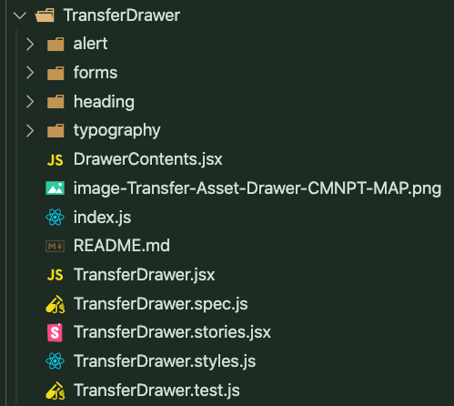
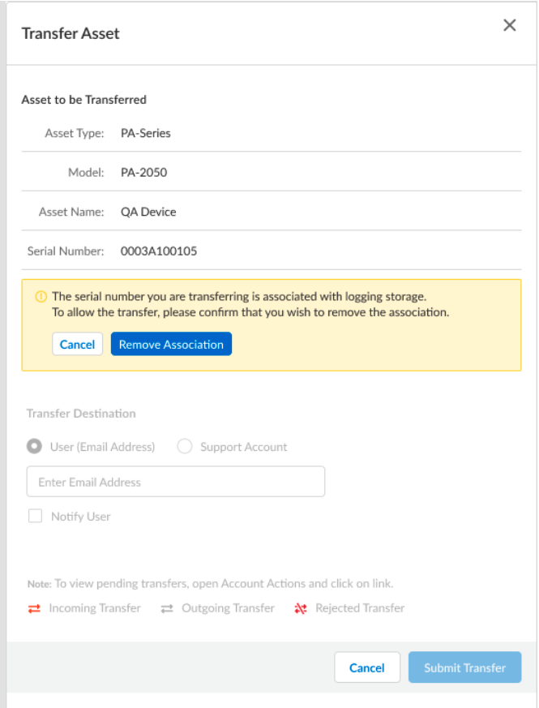
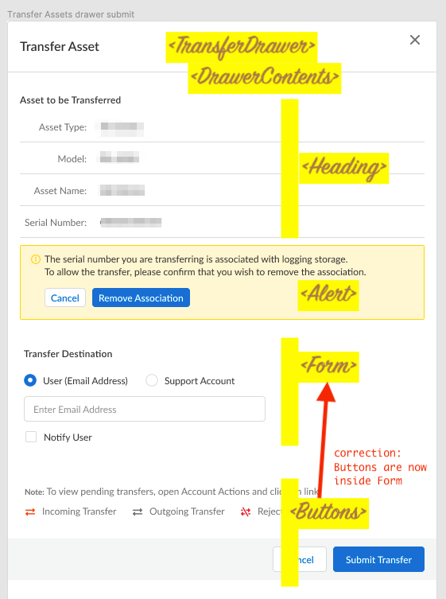

## Transfer Asset - Drawer


### File Organization



### UI Screen Shots




### Loom Demos

* [2 minute video](../../_markdown_assets/videos/Asset-Transfer-DEMO-(NS_CPT)-6-February-2022.mp4) (click `Download` or `View raw`)


### Component Map




### Code Samples:

###### TransferDrawer.jsx

```jsx  
import { bool, func } from 'prop-types';
import React from 'react';
import { useSelector } from 'react-redux';

import { assetPropType } from '../../assetPropType';
import { DrawerContents } from './DrawerContents';
import Base from './TransferDrawer.styles';

// ##################################################################################
// # Asset TRANSFER Drawer
// ##################################################################################
export const TransferDrawer = ({ visible, onClose, record }) => {
    const drawerContentsProps = {
        visible,
        record,
        onClose
    };

    const { maskLocked } = useSelector((state) => state.drawer);

    // NOTE: destroyOnClose: means that any state on Base will NOT get destroyed, only Base's children's state will get destroyed
    return (
        <Base
            width={541}
            title={<h1>Transfer Asset</h1>}
            visible={visible}
            onClose={onClose}
            maskClosable={!maskLocked}
            destroyOnClose>
            <DrawerContents {...drawerContentsProps} />
        </Base>
    );
};

TransferDrawer.propTypes = {
    visible: bool,
    onClose: func,
    record: assetPropType,
};

export default TransferDrawer;
```


TransferDrawer.styles.js

```js 
import { SideDrawer } from '@Lorem/Ipsum';
import styled from 'styled-components';

export default styled(SideDrawer)`
    .ant-drawer-body {
        display: flex;
        flex-direction: column;
        align-items: flex-start;

        & > .ant-card {
            margin-bottom: 28px;
        }

        & > .ant-table-wrapper {
            margin-bottom: 12px;
        }

        & > a,
        & > button {
            align-self: flex-end;
        }
    }
`;
```


###### DrawerContents.jsx

```jsx  
/* eslint-disable no-unused-vars */
import { Skeleton, useMounted } from '@Lorem/Ipsum';
import { PropTypes as PT } from 'prop-types';
import React, { useEffect, useState } from 'react';
import { FormSkeleton } from '../../../common/FormSkeleton';
import { assetPropType } from '../../assetPropType';
import { Alert, AlertSkeleton } from './alert';
import { TransferDestinationForm } from './forms';
import { Heading } from './heading';

// ##################################################################################
// # DRAWER CONTENTS
// ##################################################################################
export const DrawerContents = ({ visible, record, onClose }) => {
    const isMounted = useMounted();
    const [isFormDisabled, setIsFormDisabled] = useState(record.has_lgs_associated === true);
    const [fakeLoading, setFakeLoading] = useState(true);

    useEffect(() => {
        setTimeout(() => {
            setFakeLoading(false);
        }, 2000);
    }, []);

    return (
        <>
            <FormSkeleton loading={fakeLoading} noBottomMargin>
                <Heading record={record} />
            </FormSkeleton>
            <AlertSkeleton loading={fakeLoading}>
                <Alert
                    hasLogsAssociated={record.has_lgs_associated}
                    isFormDisabled={isFormDisabled}
                    setIsFormDisabled={setIsFormDisabled}
                    onClose={onClose}
                />
            </AlertSkeleton>

            <Skeleton loading={fakeLoading} style={{ marginTop: '14px' }}>
                <TransferDestinationForm
                    isFormDisabled={isFormDisabled}
                    onClose={onClose}
                    record={record}
                />
            </Skeleton>
            <Skeleton avatar loading={fakeLoading} style={{ marginTop: '28px' }} />
        </>
    );
};

DrawerContents.propTypes = {
    visible: PT.bool,
    record: assetPropType,
    onClose: PT.func,
};

export default DrawerContents;
```


###### Heading.jsx

```jsx  
import { colors, units } from '@Lorem/Ipsum';
import React from 'react';
import styled from 'styled-components';

import { assetPropType } from '../../../assetPropType';
import { Title } from '../typography';

const DefinitionList = styled.dl`
    display: grid;
    grid-template-columns: max-content auto;
    width: 100%;
    margin-bottom: ${remCalc(2)};
`;
const SubTitle = styled.dt`
    grid-column-start: 1;
    font-size: ${remCalc(12)};
    text-align: right;
    color: ${colors.grey[60]};
    border-bottom: ${remCalc(1)} solid ${colors.grey[30]};
    height: ${remCalc(36)};
    line-height: ${remCalc(32)};
    &.first {
        line-height: ${remCalc(16)};
        height: ${remCalc(29)};
    }
`;
const Description = styled.dd`
    grid-column-start: 2;
    font-size: ${remCalc(12)};
    font-weight: 400;
    text-align: left;
    color: ${colors.grey[90]};
    padding-left: ${remCalc(17)};
    border-bottom: ${remCalc(1)} solid ${colors.grey[30]};
    height: ${remCalc(36)};
    line-height: ${remCalc(32)};
    &.first {
        line-height: ${remCalc(16)};
        height: ${remCalc(29)};
    }
`;
// ##################################################################################
// HEADING
// ##################################################################################
export const Heading = ({ record }) => {
    return (
        <>
            <Title>Asset to be Transferred</Title>
            <DefinitionList>
                <SubTitle className='first'>Asset Type:</SubTitle>
                <Description className='first'>{record.type_name}</Description>
                <SubTitle>Model:</SubTitle>
                <Description>{record.model_name}</Description>
                <SubTitle>Asset Name:</SubTitle>
                <Description>{record.name}</Description>
                <SubTitle>Serial Number:</SubTitle>
                <Description>{record.serial_number}</Description>
            </DefinitionList>
        </>
    );
};

Heading.propTypes = {
    record: assetPropType,
};

export default Heading;
```


###### DefinitionList.jsx

```jsx  
import { colors, remCalc } from '@Lorem/ipsum';
import styled from 'styled-components';

export const DefinitionList = styled.dl`
    display: grid;
    grid-template-columns: max-content auto;
    width: 100%;
    margin-bottom: ${remCalc(2)};
`;
export const SubTitle = styled.dt`
    grid-column-start: 1;
    font-size: ${remCalc(10)};
    font-weight: 400;
    text-align: right;
    color: ${colors.orange[5]};
    line-height: ${remCalc(16)};
`;
export const Description = styled.dd`
    grid-column-start: 2;
    font-size: ${remCalc(12)};
    font-weight: 400;
    text-align: left;
    color: ${colors.grey[50]};
    padding-left: ${remCalc(9)};
    line-height: ${remCalc(16)};
`;
```


###### TransferDestinationForm.jsx

```jsx  
import { Radio } from '@paloaltonetworks/ethos';
import { PropTypes as PT } from 'prop-types';
import React, { useState } from 'react';
import { useSelector } from 'react-redux';
import {
    useGetSupportAccountsQuery,
    useStartTransferMutation
} from '../../../../../hooks/rtkq-api-and-hooks';
import { assetPropType } from '../../../assetPropType';
import { Title } from '../typography';
import { Buttons } from './Buttons';
import { FormItemEmail } from './FormItemEmail';
import FormItemSupportAccount from './FormItemSupportAccount';
import { StyledForm, StyledFormItemRadGrp } from './TransferDestinationForm.styles';


const DESTINATIONS = {
    USER: 'USER',
    SUPPORT_ACCOUNT: 'SUPPORT_ACCOUNT',
};

const DESTINATION_FORM_ITEMS = {
    USER: FormItemEmail,
    SUPPORT_ACCOUNT: FormItemSupportAccount,
};

// ##################################################################################
// # Transfer Destination form
// ##################################################################################
export const TransferDestinationForm = ({ record, isFormDisabled, onClose }) => {
    const [form] = StyledForm.useForm();
    const { userAccountId, supportAccountId, emailAddress } = useSelector((state) => state.auth);
    const [startTransfer, { isLoading }] = useStartTransferMutation();
    const [destination, setDestination] = useState(DESTINATIONS.USER);
    const [skipAccounts, setSkipAccounts] = useState(true);

    const { data: supportAccountOptions, isFetching: fetchingAccounts } =
        useGetSupportAccountsQuery(emailAddress, { skip: skipAccounts });

    const onFinish = async (values) => {
        await form.validateFields();
        try {
            const result = await startTransfer({
                userAccountId,
                supportAccountId,
                formValues: values,
                record,
            });
            if (!result.error) {
                onClose();
            }
        } catch (error) {
            console.log('🚀 ~ onFinish error: ', error);
        }
    };

    const onDestinationChange = (event) => {
        const val = event.target.value;
        if (val === DESTINATIONS.SUPPORT_ACCOUNT) {
            setSkipAccounts(false);
        }
        setDestination(val);
    };

    const DESTINATION_PROPS = {
        USER: {
            disabled: isFormDisabled,
        },
        SUPPORT_ACCOUNT: {
            loading: fetchingAccounts,
            options: supportAccountOptions,
            disabled: isFormDisabled,
        },
    };

    const DestinationInput = DESTINATION_FORM_ITEMS[destination];
    return (
        <>
            <Title disabled={isFormDisabled}>Transfer Destination</Title>
            <StyledForm
                initialValues={{
                    'transfer-destination': destination,
                    email: '',
                    'notify-user': false,
                }}
                form={form}
                name='register'
                onFinish={onFinish}
                scrollToFirstError>
                <StyledFormItemRadGrp
                    colon={false}
                    name='transfer-destination'
                    rules={[
                        {
                            required: true,
                            message: 'Please select a transfer destination',
                        },
                    ]}
                    onChange={onDestinationChange}>
                    <Radio.Group>
                        <Radio disabled={isFormDisabled} value={DESTINATIONS.USER}>
                            User (Email Address)
                        </Radio>
                        <Radio disabled={isFormDisabled} value={DESTINATIONS.SUPPORT_ACCOUNT}>
                            Support Account
                        </Radio>
                    </Radio.Group>
                </StyledFormItemRadGrp>
                <DestinationInput {...DESTINATION_PROPS[destination]} disabled={isFormDisabled} />
                <StyledForm.Item>
                    <Buttons onClose={onClose} isLoading={isLoading} disabled={isFormDisabled} />
                </StyledForm.Item>
            </StyledForm>
        </>
    );
};

TransferDestinationForm.propTypes = {
    record: assetPropType,
    isFormDisabled: PT.bool,
    onClose: PT.func,
};

export default TransferDestinationForm;
```


### UI Unit Testing Samples:

###### TransferDrawer.stories.jsx

```jsx  
// StoryBook
import React from 'react';

import { TransferDrawer } from '.';
import { MOCKED_RESPONSE_ASSET_DETAILS } from '../../../../mocks/mock-responses';

export default {
    title: 'Drawers > Transfer Drawer',
    component: TransferDrawer,
};

const Template = (args) => (
    <table>
        <tbody>
            <tr>
                <td>
                    <TransferDrawer
                        {...args}
                        record={MOCKED_RESPONSE_ASSET_DETAILS.data}
                        visible
                        onClose={() => {
                            console.log('🚀 ~ Closed...');
                        }}
                    />
                </td>
            </tr>
        </tbody>
    </table>
);

export const Primary = Template.bind({});
Primary.args = {
    primary: true,
    label: 'TransferDrawer',
};
```


###### TransferDrawer.spec.js

```jsx  
// Cypress (FRAGMENT)
import { MOCKED_RESPONSE_ASSET_DETAILS } from '../../../../mocks/mock-responses';

const COMPONENT_SB_PATH = '/iframe.html?path=/story/drawers-transfer-drawer--primary';
const DRAWER_BODY = '.ant-drawer-body';
// ##################################################################################
// CYPRESS + STORYBOOK
// ##################################################################################
describe('TRANSFER Drawer', () => {
    beforeEach(() => {
        cy.visit(COMPONENT_SB_PATH);
    });

    it('title should  be correct', () => {
        cy.get('.ant-drawer-title > h1').contains('Transfer Asset');
    });

    it.only('“Assets to be transferred” heading area is populated correctly', () => {
        cy.get(DRAWER_BODY).contains('Asset to be Transferred');

        // labels + values
        cy.get(DRAWER_BODY).contains('Asset Type:');
        cy.get(DRAWER_BODY).contains(MOCKED_RESPONSE_ASSET_DETAILS.data.type_name);

        cy.get(DRAWER_BODY).contains('Model:');
        cy.get(DRAWER_BODY).contains(MOCKED_RESPONSE_ASSET_DETAILS.data.model_name);

        cy.get(DRAWER_BODY).contains('Asset Name:');
        cy.get(DRAWER_BODY).contains(MOCKED_RESPONSE_ASSET_DETAILS.data.name);

        cy.get(DRAWER_BODY).contains('Serial Number:');
        cy.get(DRAWER_BODY).contains(MOCKED_RESPONSE_ASSET_DETAILS.data.serial_number);
    });

    // ... 

});
```

