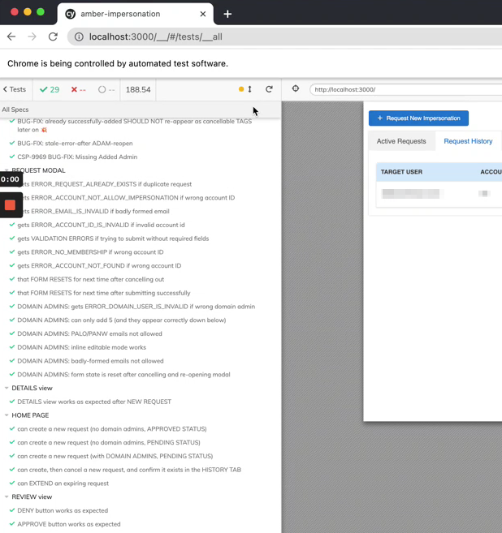

# Cypress E2E Integration Tests

Cypress played a critical role in the team's productivity increases:

* as a way to confirm no functionality had been lost while I refactored an entire MFE 
* to hunt down and fix legacy bugs (and prevent regression of)
* to serve as UI Unit Tests (Component Tests) running against StoryBook
* even for Test Driven Development (TDD)


### UI Screen Shots




### Code Samples

###### cypress/support/commands.js 

```js 
import {
    BTN_CANCEL_ACCESS,
    GOOD_ACCOUNT_ID,
    MENU_CANCEL_IMPERSONATION,
    MSG_SUCCESSFUL_REQUEST,
    PENDING_ACCOUNT_ID,
    ROW_ELLIPSIS,
    SPINNER,
    TEST_EMAIL_1,
    TEST_EMAIL_2,
    URL,
} from './_constants';

const DEFAULT_CREATE_OPTIONS = {
    lorem: [],
    ipsum: TEST_EMAIL_1,
    lorem_2: GOOD_ACCOUNT_ID,
    ipsum_2: true,
};
const DEFAULT_SETUP_4_REVIEW_SPEC_OPTIONS = {
    a: TEST_EMAIL_2,
    b: PENDING_ACCOUNT_ID,
    c: false,
};

// ##################################################################################
// # CUSTOM COMMANDS
// ##################################################################################

Cypress.Commands.add('createRequest', (options = DEFAULT_CREATE_OPTIONS) => {
    const mergedOptions = {
        ...DEFAULT_CREATE_OPTIONS,
        ...options,
    };
    const { lorem, ipsum, a, b } = mergedOptions;
    cy.contains('Request to Impersonate a User').should('exist');
    cy.get('input#lorem').type(email);
    cy.get('input#ipsum').type(lorem);
    if (domains && domains.length) {
        cy.addDomains(domains);
    }
    if (confirmSuccess) {
        cy.contains(MSG_SUCCESSFUL_REQUEST, { timeout: 8000 }).should('not.exist');
    }
    cy.findByRole('button', { name: /submit/i }).click();
    if (confirmSuccess) {
        cy.contains(MSG_SUCCESSFUL_REQUEST, { timeout: 8000 }).should('exist');
        cy.contains('Request to Impersonate a User').should('not.exist');
    }
});

Cypress.Commands.add('cancelRequest', () => {
    cy.clickFirstEllipsis();
    cy.contains(MENU_CANCEL_IMPERSONATION).click();
    cy.findByRole('button', { name: BTN_CANCEL_ACCESS }).click();
    cy.contains(MSG_SUCCESSFUL_REQUEST, { timeout: 8000 }).should('exist');
    cy.findByRole('button', { name: /View Details/i }).should('not.exist');
});


Cypress.Commands.add('cancelAllRequests', () => {
    cy.get(SPINNER).should('exist');
    cy.wait(2000);
    cy.get(SPINNER).should('not.exist');
    cy.getNumberOfActiveRequests().then(numActiveRequests => {
        for (const i of Array(numActiveRequests)) {
            cy.cancelRequest();
            cy.visit(URL);
        }
    });
});


Cypress.Commands.add('getNumberOfActiveRequests', () => {
    cy.get('.ant-table-content').then($table => {
        if ($table.find('button').length !== 0) {
            return cy
                .get(ROW_ELLIPSIS)
                .its('length')
                .then(nActiveRequests => {
                    return cy.wrap(nActiveRequests);
                });
        }
        return cy.wrap(0);
    });
});

// ... FRAGMENT
```


###### cypress/integration/modals/request-modal.spec.js

```js 
import {
    BTN_NEW_REQUEST, ERROR_ACCOUNT_ID_IS_INVALID, ERROR_ACCOUNT_NOT_ALLOW_IMPERSONATION, ERROR_ACCOUNT_NOT_FOUND, ERROR_DOMAIN_USER_IS_INVALID, ERROR_EMAIL_IS_INVALID, ERROR_ENTER_NON_PALO_EMAIL, ERROR_NO_MEMBERSHIP, ERROR_REQUEST_ALREADY_EXISTS, ERROR_USER_NOT_A_DA, GOOD_ACCOUNT_ID, INPUT_TAGS, INPUT_TAGS_LIST, LOOP, SAMPLE_DOMAIN, TEST_EMAIL_1, TEST_EMAIL_2, TEST_EMAIL_DOMAIN_ADMIN, URL
} from '../../support/_constants'

// ##################################################################################
// # REQUEST MODAL tests
// ##################################################################################
Cypress._.times(LOOP, () => {
    describe('REQUEST MODAL', () => {

        before(() => {
            cy.visit(URL);
            cy.cancelAllRequests();
        });
        
        beforeEach(() => {
            cy.visit(URL)
            cy.findByRole('button', { name: BTN_NEW_REQUEST }).click()
        })

        it('gets ERROR_REQUEST_ALREADY_EXISTS if duplicate request', () => {
            cy.createRequest()
            cy.findByRole('button', { name: BTN_NEW_REQUEST }).click()
            cy.contains(ERROR_REQUEST_ALREADY_EXISTS).should('not.exist')
            cy.createRequest({ confirmSuccess: false })
            cy.contains(ERROR_REQUEST_ALREADY_EXISTS).should('exist')
            cy.esc()
            cy.cancelRequest()
        })

        it('gets ERROR_ACCOUNT_NOT_ALLOW_IMPERSONATION if wrong account ID', () => {
            const id = '00'
            cy.get('input#lorem').type(TEST_EMAIL_1)
            cy.get('input#ipsum').type(id)
            cy.contains(ERROR_ACCOUNT_NOT_ALLOW_IMPERSONATION).should('not.exist')
            cy.findByRole('button', { name: /submit/i }).click()
            cy.contains(ERROR_ACCOUNT_NOT_ALLOW_IMPERSONATION).should('exist')
        })

        it('gets ERROR_EMAIL_IS_INVALID if badly formed email', () => {
            cy.contains(ERROR_EMAIL_IS_INVALID).should('not.exist')
            cy.get('input#lorem').type('blabla.com')
            cy.contains(ERROR_EMAIL_IS_INVALID).should('exist')
            cy.findByRole('button', { name: /submit/i }).click()
            cy.contains(ERROR_EMAIL_IS_INVALID).should('exist')
        })

        it('gets ERROR_ACCOUNT_ID_IS_INVALID if invalid account id', () => {
            cy.contains(ERROR_ACCOUNT_ID_IS_INVALID).should('not.exist')
            cy.get('input#ipsum').type('bla-wrong')
            cy.contains(ERROR_ACCOUNT_ID_IS_INVALID).should('exist')
            cy.findByRole('button', { name: /submit/i }).focus().click({ force: true })
            cy.contains(ERROR_ACCOUNT_ID_IS_INVALID).should('exist')
        })

        it('gets VALIDATION ERRORS if trying to submit without required fields', () => {
            cy.contains(ERROR_EMAIL_IS_INVALID).should('not.exist')
            cy.contains(ERROR_ACCOUNT_ID_IS_INVALID).should('not.exist')
            cy.findByRole('button', { name: /submit/i }).click()
            cy.contains(ERROR_EMAIL_IS_INVALID).should('exist')
            cy.contains(ERROR_ACCOUNT_ID_IS_INVALID).should('exist')
        })

        it('gets ERROR_NO_MEMBERSHIP if wrong account ID', () => {
            const id = '000'
            cy.get('input#lorem').type(TEST_EMAIL_1)
            cy.get('input#ipsum').type(id)
            cy.contains(ERROR_NO_MEMBERSHIP).should('not.exist')
            cy.findByRole('button', { name: /submit/i }).click()
            cy.contains(ERROR_NO_MEMBERSHIP).should('exist')
        })

        it('gets ERROR_ACCOUNT_NOT_FOUND if wrong account ID', () => {
            const id = '000000'
            cy.get('input#lorem').type(TEST_EMAIL_1)
            cy.get('input#ipsum').type(id)
            cy.contains(ERROR_ACCOUNT_NOT_FOUND(id)).should('not.exist')
            cy.findByRole('button', { name: /submit/i }).click()
            cy.contains(ERROR_ACCOUNT_NOT_FOUND(id)).should('exist')
        })

        it('that FORM RESETS for next time after cancelling out', () => {
            const domain = SAMPLE_DOMAIN
            cy.get('input#lorem').type(TEST_EMAIL_1)
            cy.get('input#ipsum').type(GOOD_ACCOUNT_ID)
            cy.addDomains([domain])
            cy.esc()
            cy.findByRole('button', { name: BTN_NEW_REQUEST }).click()
            cy.get('input#lorem').should('have.value', '')
            cy.get('input#ipsum').should('have.value', '')
            cy.get(INPUT_TAGS).should('have.value', '')
        })

        it('that FORM RESETS for next time after submitting successfully', () => {
            cy.createRequest()
            cy.findByRole('button', { name: BTN_NEW_REQUEST }).click()
            cy.get('input#lorem').should('have.value', '')
            cy.get('input#ipsum').should('have.value', '')
            cy.get(INPUT_TAGS).should('have.value', '')
            cy.esc()
            cy.cancelRequest()
        })

        it('DOMAIN ADMINS: gets ERROR_DOMAIN_USER_IS_INVALID if wrong domain admin', () => {
            const domain = SAMPLE_DOMAIN
            cy.get('input#lorem').type(TEST_EMAIL_1)
            cy.get('input#ipsum').type(GOOD_ACCOUNT_ID)
            cy.addDomains([domain])
            cy.contains(ERROR_DOMAIN_USER_IS_INVALID).should('not.exist')
            cy.findByRole('button', { name: /submit/i }).click()
            cy.contains(ERROR_DOMAIN_USER_IS_INVALID).should('exist')
        })

        it('DOMAIN ADMINS: can only add 5 (and they appear correctly down below)', () => {
            const domains = [
                'bla1@foo.com',
                'bla2@foo.com',
                'bla3@foo.com',
                'bla4@foo.com',
                'bla5@foo.com',
            ]
            cy.get('input#lorem').type(TEST_EMAIL_1)
            cy.get('input#ipsum').type(GOOD_ACCOUNT_ID)
            cy.addDomains(domains)
            cy.get(INPUT_TAGS).should('be.disabled')
        })

        it('DOMAIN ADMINS: PALO/LOREM emails not allowed', () => {
            const domainLOREM = 'someone@LOREM.com'
            cy.get('input#lorem').type(TEST_EMAIL_1)
            cy.get('input#ipsum').type(GOOD_ACCOUNT_ID)
            cy.addDomains([domainLOREM])
            cy.contains(ERROR_ENTER_NON_PALO_EMAIL).should('exist')
            cy.findByRole('button', { name: /submit/i }).focus().click({ force: true })
            cy.contains(ERROR_ENTER_NON_PALO_EMAIL).should('exist')
            cy.removeMultitag({ nthTagToRemove: 0, nthTagText: domainLOREM, expectedTotalNumOfTags: 1 })
            cy.contains(ERROR_ENTER_NON_PALO_EMAIL).should('not.exist')
            const domainPALO = 'someone@IPSUM.com'
            cy.addDomains([domainPALO])
            cy.contains(ERROR_ENTER_NON_PALO_EMAIL).should('exist')
            cy.findByRole('button', { name: /submit/i }).focus().click({ force: true })
            cy.contains(ERROR_ENTER_NON_PALO_EMAIL).should('exist')
            cy.removeMultitag({ nthTagToRemove: 0, nthTagText: domainPALO, expectedTotalNumOfTags: 1 })
            cy.contains(ERROR_ENTER_NON_PALO_EMAIL).should('not.exist')
            cy.findByRole('button', { name: /submit/i }).click()
            cy.cancelRequest()
        })

        it('DOMAIN ADMINS: inline editable mode works', () => {
            const domainLOREM = 'someone@LOREM.com'
            cy.get('input#lorem').type(TEST_EMAIL_1)
            cy.get('input#ipsum').type(GOOD_ACCOUNT_ID)
            cy.addDomains([domainLOREM])
            cy.contains(ERROR_ENTER_NON_PALO_EMAIL).should('exist')
            cy.findByRole('button', { name: /submit/i }).focus().click({ force: true })
            cy.contains(ERROR_ENTER_NON_PALO_EMAIL).should('exist')
            cy.get('.ant-tag')
                .should('have.length', 1)
                .first()
                .should('have.text', domainLOREM)
                .dblclick()
            cy.get('.lorem-multitag > .ant-input:nth-child(2)')
                .clear()
                .type(SAMPLE_DOMAIN)
                .tab()
            cy.contains(ERROR_ENTER_NON_PALO_EMAIL).should('not.exist')
        })

        it('DOMAIN ADMINS: badly-formed emails not allowed', () => {
            const domainBad = 'bad-formed-email.com'
            cy.get('input#lorem').type(TEST_EMAIL_1)
            cy.get('input#ipsum').type(GOOD_ACCOUNT_ID)
            cy.addDomains([domainBad])
            cy.contains(ERROR_ENTER_NON_PALO_EMAIL).should('exist')
            cy.findByRole('button', { name: /submit/i }).focus().click({ force: true })
            cy.contains(ERROR_ENTER_NON_PALO_EMAIL).should('exist')
        })

        it('DOMAIN ADMINS: form state is reset after cancelling and re-opening modal', () => {
            const someEmail = 'stale@email.com'
            cy.get('input#lorem').type(TEST_EMAIL_1)
            cy.get('input#ipsum').type(GOOD_ACCOUNT_ID)
            cy.addDomains([someEmail])
            cy.contains(ERROR_DOMAIN_USER_IS_INVALID).should('not.exist')
            cy.findByRole('button', { name: /submit/i }).click()
            cy.contains(ERROR_DOMAIN_USER_IS_INVALID).should('exist')
            cy.get('input#lorem').should('have.value', TEST_EMAIL_1)
            cy.get('input#ipsum').should('have.value', GOOD_ACCOUNT_ID)
            cy.esc()
            cy.findByRole('button', { name: BTN_NEW_REQUEST }).click()
            cy.get(INPUT_TAGS_LIST).should('have.length', 0)

            const someOtherEmail = 'new@email.com'
            cy.addDomains([someOtherEmail])
            cy.get(INPUT_TAGS_LIST).should('have.length', 1)

            cy.esc()
            cy.findByRole('button', { name: BTN_NEW_REQUEST }).click()
            cy.get(INPUT_TAGS_LIST).should('have.length', 0)

            const someThirdEmail = 'THIRD@email.com'
            cy.addDomains([someThirdEmail, someOtherEmail])
            cy.get(INPUT_TAGS_LIST).should('have.length', 2)

            cy.esc()
            cy.findByRole('button', { name: BTN_NEW_REQUEST }).click()
            cy.get(INPUT_TAGS_LIST).should('have.length', 0)

            cy.contains(ERROR_USER_NOT_A_DA(GOOD_ACCOUNT_ID)).should('not.exist')
            cy.createRequest({
                email: TEST_EMAIL_1,
                supportAccountId: GOOD_ACCOUNT_ID,
                domains: [TEST_EMAIL_1, TEST_EMAIL_2, TEST_EMAIL_DOMAIN_ADMIN],
                confirmSuccess: false,
            })
            cy.contains(ERROR_USER_NOT_A_DA(GOOD_ACCOUNT_ID)).should('exist')
            cy.get('input#lorem').should('have.value', TEST_EMAIL_1)
            cy.get('input#ipsum').should('have.value', GOOD_ACCOUNT_ID)
            cy.removeMultitag({ nthTagToRemove: 2, nthTagText: TEST_EMAIL_DOMAIN_ADMIN, expectedTotalNumOfTags: 3 })
            cy.removeMultitag({ nthTagToRemove: 1, nthTagText: TEST_EMAIL_2, expectedTotalNumOfTags: 2 })

            cy.findByRole('button', { name: BTN_NEW_REQUEST }).focus().click({ force: true })
            cy.contains(ERROR_USER_NOT_A_DA(GOOD_ACCOUNT_ID)).should('not.exist')

        })

    })
})
```

