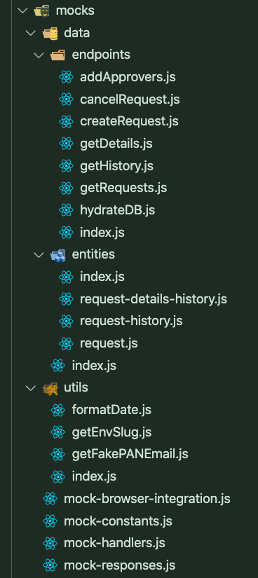

# Mock Service Worker

I mocked multiple entire APIs for various MFEs, and for more complex workflows, used  ``@mswjs/data`` for mocked data persistence and modelling. The **same** mocked APIs were used daily by the entire team for multiple uses and applications:

* rapid prototyping
* development
* bug fixing
* unit and E2E testing


### File Organization




### Code Samples

###### mock-handlers.js

```js
import { factory, rest } from '@Lorem/Ipsum';
import {
    addApprovers,
    cancelRequest,
    createRequest,
    entities,
    getDetails,
    getHistory,
    getRequests,
} from './data';
import {
    MOCKED_RESPONSE_APPROVE,
    MOCKED_RESPONSE_DENY,
    MOCKED_RESPONSE_EXTEND,
} from './mock-responses';
import { getEnvSlug } from './utils';

const db = factory(entities);
const envSlug = getEnvSlug(process.env.REACT_APP_API_BASE_URL);
const BASE_URL = `https://lorem.${envSlug}.ipsum.com/api/Lorem/Ipsum/`;
console.log(`💪 MSW will be intercepting from the BASE_URL: ${BASE_URL}`);
const DELAY = process.env.NODE_ENV === 'test' ? 0 : 300;
hydrateDB(db);

// ##################################################################################
// MOCK API ENDPOINT HANDLERS
// ##################################################################################
export const handlers = [
    rest.post(BASE_URL, async (req, res, ctx) => {
        switch (req.body.impersonateAction) {
            case 'activerequests':
                return res(ctx.delay(DELAY), ctx.json(getRequests(db)));

            case 'history':
                return res(ctx.delay(DELAY), ctx.json(getHistory(db)));

            case 'extend':
                return res(ctx.delay(DELAY), ctx.json(MOCKED_RESPONSE_EXTEND));

            case 'details':
                return res(ctx.delay(DELAY), ctx.json(getDetails(db, req.body.requestId)));

            case 'create':
                return res(ctx.delay(DELAY), ctx.json(createRequest(db, req.body)));

            case 'addApprovers':
                return res(
                    ctx.delay(DELAY),
                    ctx.json(addApprovers(db, req.body.requestId, req.body.approverEmailAddresses))
                );

            case 'update':
                switch (req.body._subAction) {
                    case 'approve':
                        return res(ctx.delay(DELAY), ctx.json(MOCKED_RESPONSE_APPROVE));
                    case 'deny':
                        return res(ctx.delay(DELAY), ctx.json(MOCKED_RESPONSE_DENY));
                    case 'cancel':
                        return res(
                            ctx.delay(DELAY),
                            ctx.json(cancelRequest(db, req.body.requestId))
                        );
                    default:
                        return res(
                            ctx.status(500),
                            ctx.json({
                                message: 'MOCK SERVER HANDLER ERROR: missing _subAction field',
                            })
                        );
                }

            default:
                return res(
                    ctx.status(500),
                    ctx.json({
                        message: 'MOCK SERVER HANDLER ERROR: missing impersonateAction field',
                    })
                );
        }
    }),
];

export default handlers;
```


###### src/mocks/data/endpoints/getHistory.js

```js 
import { IMPERSONATE_REQUEST_STATUS } from '../../../constants';

// ##################################################################################
// # getHistory MOCK ENDPOINT
// ##################################################################################
export const getHistory = db => {
    const history = db.request
        .getAll()
        .filter(request =>
            [
                IMPERSONATE_REQUEST_STATUS.A,
                IMPERSONATE_REQUEST_STATUS.B,
                IMPERSONATE_REQUEST_STATUS.C,
                IMPERSONATE_REQUEST_STATUS.D,
                IMPERSONATE_REQUEST_STATUS.E,
            ].includes(request.impersonateStatus),
        );
    return {
        data: {
            loremIpsum: history,
        },
    };
};
export default getHistory;
```

