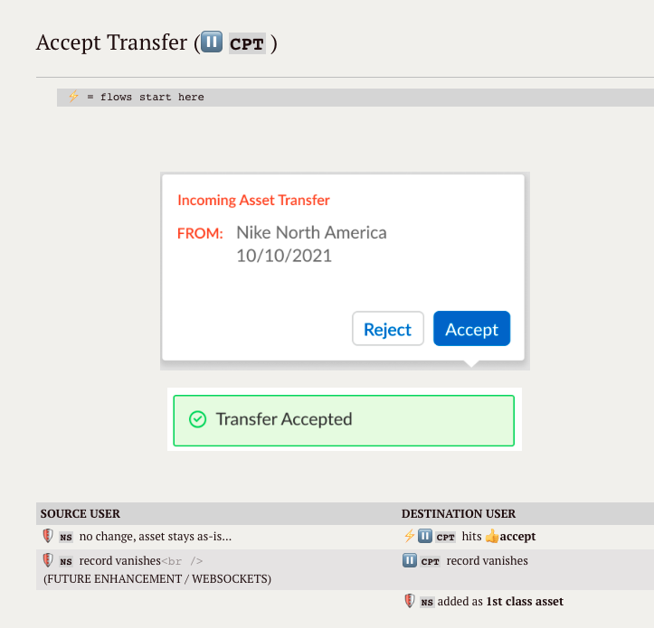

# 📝 Sample Design Document

Fragment from a `Hi-Level Design Doc` of all Asset Transfer workflows, helping to illustrate clearly:

* `Source` VS `Destination` users
* which MFE the action or event occurs in, i.e. ⏸ **`CPT`** VS 🛡 **`NS`** 
* and current limitations (`FUTURE ENHANCEMENTS`)

