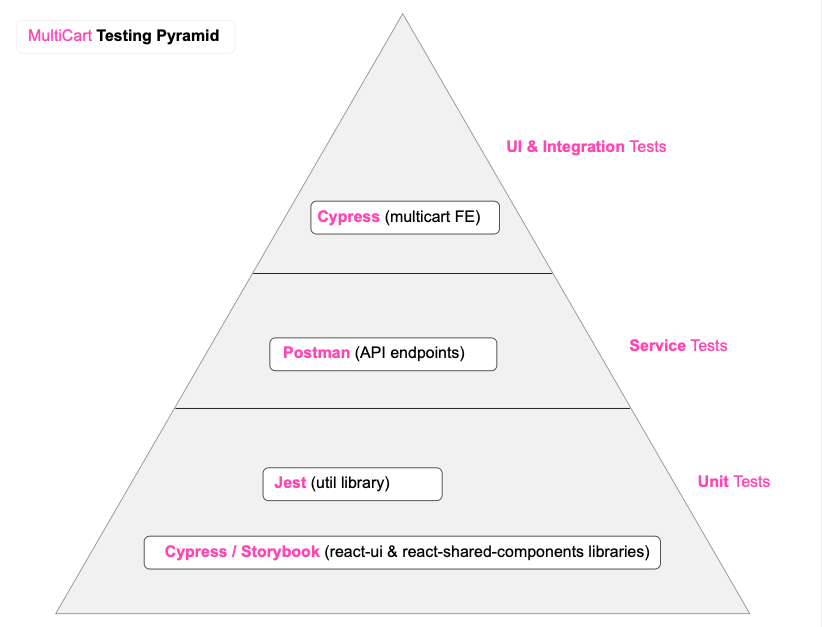

# 📊 Flowcharts and Diagrams

### My "Testing Pyramid"

From a personal project ([multicart](https://www.multicart.app/))

### Tech Debt & Refactoring Journey

A simplified flow-chart highlighting key points in the path I took to successfully remove a huge amount of technical debt and refactor multiple MFEs, while simultaneously delivering much-loved new UI features:

### Simplified "Where to Put State" Flow Chart

Inspired by [Kent Dodds' decision tree chart](https://kentcdodds.com/blog/state-colocation-will-make-your-react-app-faster#so-how-do-you-decide-where-to-put-state):

### My "JIRA Process" 

From a FE Perspective:

```mermaid
graph TD
      A(("🎽 Start with an EPIC")) --> B("🏋️‍♀️Medium-to-hard sprint points need a short DESIGN DOC")
      B --> |"🎨 UI/UX Figma, prototypes, hand-offs"| C("📌 `PIN POINTS` mapping each endpoint to UI/UX")
      C --> D("📬 POSTMAN  endpoints, payloads, etc.")
      D ==> |if design doc exists| E{"🖋 Team sign-off on design doc"}
      E --> |Assign to team members| F("🪓  Break into STORIES, write full AC/requirements, weigh points")
      F --> |FE, BE, PROXY, INTEGRATION stories| G("🖨 Clone stories as needed for team")
      G --> |Use JIRA templates I provided| GG("🔪 Break stories into SUB-TASKS, if needed")
      GG --> |"🗣 Shout-outs on any blockers"| H("👷‍♂️👷‍♀️ Development work ...🚧")
      H --> |Finalize any stubbed-out Postman endpoints| GG
```

